# FriendVenture
Advanced Front-End Portfolio Project(PP5) - Code Institute

View the deployed site [here.](https://friendventure-702f1b6ed9cf.herokuapp.com/)<br>

The idea for this network has been with me for many years. A friend went through a tough breakup and, at the time, she and her former partner were very engaged in activities like canoeing and climbing. With her partner gone, she found it challenging to participate in these activities, as she missed having someone to join her without any romantic expectations—essentially, she wanted a “not a date” option. Given the scope of the platform was too broad for the project's limited timeframe, I decided to pursue a streamlined version. FriendVenture is designed as a platform for friends to organize and participate in events, known as FriendVentures, without the pressure of romantic connotations.

The FriendVenture frontend is the user interface component of the FriendVenture application, designed with React to provide an engaging and intuitive experience for users interacting with the social network. It connects with the [FriendVenture API](https://friendventure-api-8b417af3d1a0.herokuapp.com/), enhancing user experience by offering a responsive and dynamic interface.

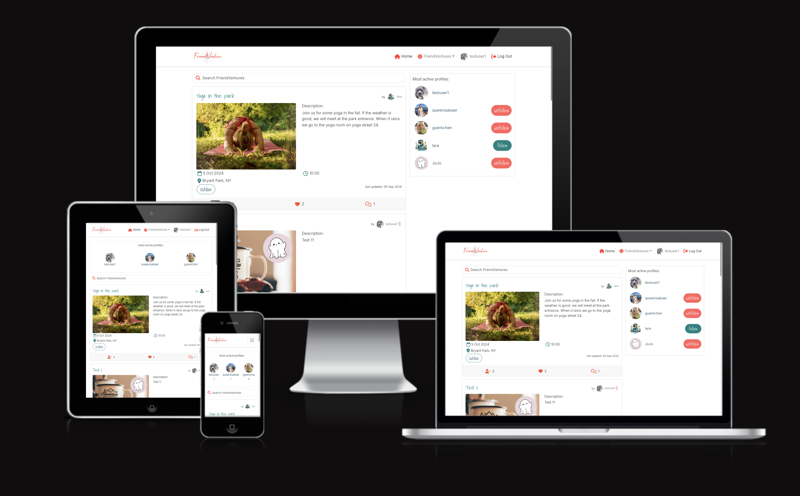<br>

## Table of contents

- [User Experience](#user-experience)
  - [Milestones](#milestones)
  - [Epics and User stories](#epics-and-user-stories)
- [Design](#design)
  - [Wireframes](#wireframes)
  - [Logo](#logo)
  - [Favicon](#favicon)
  - [Typography](#typography)
- [Structure](#structure)
- [Database](#database)
- [Features](#features)
- [Bugs](#bugs)
- [Technologies Used](#technologies-used)
  - [Languages](#languages)
  - [Tools](#tools)
  - [Frameworks](#frameworks)
  - [Libraries and modules](#libraries-and-modules)
- [Testing](#testing)
  - [Validator Testing](#validator-testing)
  - [Lighthouse Test](#lighthouse-test)
  - [Manual testing](#manual-testing)
  - [Browser Compatibility](#browser-compatibility)
  - [Automated Testing](#automated-testing)
- [Deployment](#deployment)
  - [Heroku](#heroku)
  - [Local deployment](#local-deployment)
  - [Forking this GitHub repository](#forking-this-github-repository)
  - [Clone this repository](#clone-this-repository)
- [Credits](#credits)
  - [Content](#content)
  - [Code](#code)
  - [ReadMe](#readme)
  - [Acknowledgments](#acknowledgments)

## User Experience

I used an Agile methodology approach to plan this project. This was implemented through the GitHub Project board with milestones, epics, user stories and tasks. Given the limited time frame, I've prioritized creating a broad overview of the project's features through high-level user stories, epics, and milestones. In a collaborative environment, I would delve into more granular user stories to ensure a comprehensive understanding of the requirements.
Each user story was classified with a label according to MoSCoW prioritization.<br>
The Kanban board can be seen [here](https://github.com/users/queenisabaer/projects/4).

### Milestones

The project was divided into five milestones, each containing the corresponding epics and user stories:<br>
- [Basic Website Setup](https://github.com/queenisabaer/friendventure/milestone/1)
- [FriendVenture MVP - API](https://github.com/queenisabaer/friendventure/milestone/5)
- [FriendVenture MVP - User Authentication & Profile Management](https://github.com/queenisabaer/friendventure/milestone/2)
- [FriendVenture MVP - FriendVenture Feature](https://github.com/queenisabaer/friendventure/milestone/3)
- [Testing and Validation](https://github.com/queenisabaer/friendventure/milestone/4)

### Epics and User stories

*FriendVenture* is designed for active individuals who love to connect and explore new experiences with others. The platform offers a space for users to discover and participate in activities called FriendVentures. While it’s open to everyone, the primary focus is on those who enjoy staying active, socializing, and trying new things. FriendVenture helps users connect with like-minded people and enrich their social life.<br>

List of Epics: <br>
- [EPIC: Repository and agile tool](https://github.com/queenisabaer/friendventure/issues/1)
- [EPIC: API - Basic Profile & FriendVenture Management](https://github.com/queenisabaer/friendventure/issues/33)
- [EPIC: API - Social Interactions](https://github.com/queenisabaer/friendventure/issues/34)
- [EPIC: User Registration and Authentication](https://github.com/queenisabaer/friendventure/issues/5)
- [EPIC: Profile Management](https://github.com/queenisabaer/friendventure/issues/9)
- [EPIC: FriendVenture Creation](https://github.com/queenisabaer/friendventure/issues/13)
- [EPIC: Engage with a FriendVenture](https://github.com/queenisabaer/friendventure/issues/17)
- [EPIC: Testing](https://github.com/queenisabaer/friendventure/issues/23)
- [EPIC: Validation](https://github.com/queenisabaer/friendventure/issues/27)

User Stories with their id:  <br>
- As a new user I want to register an account so that I can fully interact with the website. [#6](https://github.com/queenisabaer/friendventure/issues/6)
- As a user I can log in to the website so that I can use all the features of the website.[#7](https://github.com/queenisabaer/friendventure/issues/7)
- As a logged-in user I am able to log out so that I can keep my account secure. [#8](https://github.com/queenisabaer/friendventure/issues/8)
- As a logged-in user, I want to view my profile and the profiles of other users so that I can see profile information, their friendventures, and updates. [#10](https://github.com/queenisabaer/friendventure/issues/10)
- As a logged-in user I can follow or unfollow another user so that can see their updates and FriendVentures in my feed. [#12](https://github.com/queenisabaer/friendventure/issues/12)
- As a logged-in user I can create a new FriendVenture so that I can invite my friends to join the activity. [#14](https://github.com/queenisabaer/friendventure/issues/14)
- As a logged-in user I want to edit my existing FriendVenture so that I can update details if plans change. [#15](https://github.com/queenisabaer/friendventure/issues/15)
- As a logged-in user I can delete my existing FriendVenture so that I can remove it if the event is cancelled. [#16](https://github.com/queenisabaer/friendventure/issues/16)
- As a logged-in user I can comment on a FriendVenture so that I can share my thoughts or ask questions about the event. [#18](https://github.com/queenisabaer/friendventure/issues/18)
- As a logged-in user I can mark myself as participating in a FriendVenture so that others know I will be attending. [#20](https://github.com/queenisabaer/friendventure/issues/20)
- As a logged-in user I can bookmark a FriendVenture to remember so that I can easily find it later. [#21](https://github.com/queenisabaer/friendventure/issues/21)
- As a logged-in user I can like a comment on a FriendVenture so that I can show my appreciation for valuable comments. [#22](https://github.com/queenisabaer/friendventure/issues/22)
- As a logged-in user I can rate a FriendVenture so that I can show the creator of the event and other users how the event was. [#19](https://github.com/queenisabaer/friendventure/issues/19)


<br>

- As a superuser I can see a list of all profiles so that I can see all profiles that have been set up.[#32](https://github.com/queenisabaer/friendventure/issues/32)
- As a superuser I can see details of a profile so that I can see a person's profile data.[#32](https://github.com/queenisabaer/friendventure/issues/32)
- As a superuser I can see a list of all FriendVentures so that I can see all FriendVentures that have been set up. [#35](https://github.com/queenisabaer/friendventure/issues/35)
- As a superuser I can seethe details of a FriendVenture so that I can see all information about a specific FriendVentures. [#35](https://github.com/queenisabaer/friendventure/issues/35)
- As a superuser I can filter FriendVentures by category so that I can see only the FriendVentures associated with a specific category. [#35](https://github.com/queenisabaer/friendventure/issues/35)
- As a superuser I can see a list of all comments related to a FriendVenture so that I can see all comments that have been created for a friendventure by id. [#36](https://github.com/queenisabaer/friendventure/issues/36)
- As a superuser I can create a follow to another user so that I can follow other users. [#37](https://github.com/queenisabaer/friendventure/issues/37)
- As a superuser, I can view a list of all participants in a FriendVenture so that I can track who is joining each activity [#38](https://github.com/queenisabaer/friendventure/issues/38)
- As a superuser, I can view the participation details for a specific FriendVenture so that I can see which users are involved in that particular activity. [#38](https://github.com/queenisabaer/friendventure/issues/38)
- As a superuser, I can view all FriendVentures that users have added to their bookmarks lists so that I can see which activities users are interested in revisiting. [#39](https://github.com/queenisabaer/friendventure/issues/39)
- As a superuser, I can view details of specific FriendVentures in a user’s bookmarks list so that I can understand user interests and preferences. [#39](https://github.com/queenisabaer/friendventure/issues/39)

<br>

- As a developer, I require a repository on GitHub for the front-end part of the project so that I have full control over the project versions. [#2](https://github.com/queenisabaer/friendventure/issues/2)
- As a developer, I require a repository on Github for the api of the project so that I have full control over project versions [#3](https://github.com/queenisabaer/friendventure/issues/3)
- As a developer, I want to add a working kanban board to my repository so that I can track the tasks involved in creating the project.[4](https://github.com/queenisabaer/friendventure/issues/4)
- As a developer, I can automatically create a user profile when a new user signs up for my application so that the user has a profile ready for them upon registration.[#32](https://github.com/queenisabaer/friendventure/issues/32)
- As a developer, I want to implement python test procedures so that I can assess functionality, usability, responsiveness, and data management throughout the web application. [#24](https://github.com/queenisabaer/friendventure/issues/24)
- As a developer, I want to implement JavaScript test procedures so that I can assess functionality, usability, responsiveness, and data management throughout the web application. [#25](https://github.com/queenisabaer/friendventure/issues/25)
- As a developer, I want to implement manual test cases so that I can assess functionality, usability, responsiveness, and data management throughout the web application. [#26](https://github.com/queenisabaer/friendventure/issues/26)
- As a developer, I need to verify that my css files pass the W3C validation so that the code is executed correctly. [#29](https://github.com/queenisabaer/friendventure/issues/29)
- As a developer, I need to verify that my JavaScript files pass the jshint validation so that the code is executed correctly.[#30](https://github.com/queenisabaer/friendventure/issues/30)
- As a developer, I need to verify that my python files pass the pep8 validation so that the code is executed correctly. [#31](https://github.com/queenisabaer/friendventure/issues/31)
<br>

- As an admin, I want to access the site's administrative features so that I have access to the admin panel. [#8](https://github.com/queenisabaer/wishlist/issues/8)

## Design

### Wireframes
Due to lack of time, some of the originally planned features that can be seen on the wireframe had to be deleted or implemented differently. A detailed description of the existing features, how they differ from the wireframes can be found [here](#features). 

<details>
<summary> Home </summary>
<br>
 <br>

<br>
<br>

</details>

<details>
<summary> xxx </summary>
<br>
The 'sign up' page xxx<br>

<br>
<br>

</details>


### Imagery
 
The friendly ghost, which can be seen in the placeholder images or in the not found sections, was found at Pixabay. It was created by [madebytin](https://pixabay.com/de/illustrations/geist-boo-halloween-niedlich-8250317/) The pink of the cheeks was also integrated into the color palette.

The logo, the not found image, the 404 image, the placeholder images of the users' profile and of the FriendVentures were designed by me with [Canva](https://www.canva.com/).

#### Logo

 The FriendVenture logo features a light grey compass as the central symbol, with the brand name "FriendVenture" written above it in a handwritten red font. The choice of a compass represents exploration, guidance, and the spirit of adventure, perfectly aligning with the theme of discovering new experiences and journeys with friends.<br>

  <br>

#### Favicon

The favicon was created with [Favicon.io](https://favicon.io/favicon-generator/) by using the logo in a square form.<br>

  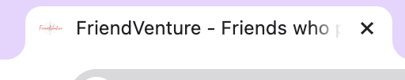

#### Colour Scheme:
  
The color palette was created based on the red color of the logo text with [ColorSpace](https://mycolor.space/?hex=%23FF3131&sub=1). Additionally, the pink from the cheeks of the little ghost, which always serves as a placeholder, was used.


<details>
<summary> Click here to see the colour palette </summary>
<br>

I created this colour palette with [coloors](https://coolors.co/).<br>
<br>

</details>

### Typography

[Shadows Into Light](https://fonts.google.com/specimen/Shadows+Into+Light) was used as font for headings. This font is similar to the one used in the logo. Since the logo was designed with Canva and the font used was not freely available, I searched for a similar-looking alternative.<br>
[Inter](https://fonts.google.com/specimen/Inter) was selected for text content. It is a clean font that goes really well with the heading font. Both fonts were imported via Google Fonts. 

## Structure 

The first database schema was crafted during the planning phase of the project. The second one was created after finishing the project. It only adds two created_at fields and renames some of the tables. Both schemas were created with [dbdiagramm](https://dbdiagram.io/home). 

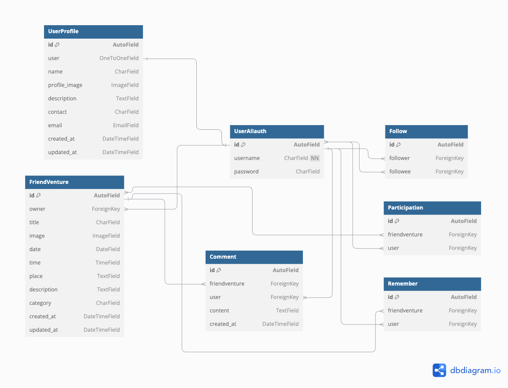<br>
Final ERD:<br>
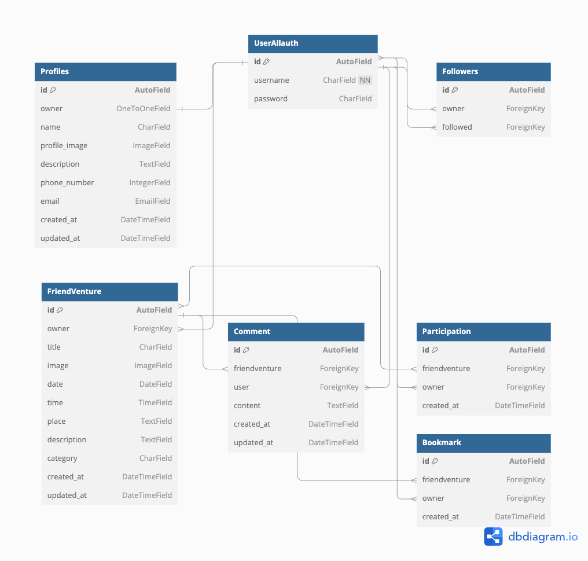<br>

## Database<br>
I used a PostgreSQL provided by Code Institute as relational database.<br>

- **FieldTypes:**<br>
  - AutoField: An integer field that automatically increments.
  - CharField: A text field with a maximum length.
  - EmailField: A CharField that checks if the value is a valid email address.
  - DateTimeField: A field for storing date and time.
  - DateField: A field for storing dates.
  - TimeField: A field for storing time.
  - TextField: A large text field.
  - ImageField: 
  - OneToOneField: A one-to-one relationship.
  - ForeignKey: A many-to-one relationship.
  - IntegerField: An integer field.
  - EmailField: 
  - DecimalField: A fixed-precision decimal number.
  - URLField: A CharField for URLs.<br>
- **Relationships:**<br>
  - A User has one Profile.
  - A Profile belongs to one User.
  - A FriendVenture is created by one User.
  - A User can create many FriendVentures.
  - A User can be a Participant in a FriendVenture.
  - Participant belongs to one User and one Friendventure
  - A User can bookmark a FriendVenture.
  - Bookmark belongs to one User and one Friendventure
  - A User can create a Comment for a FriendVenture. 
  - A Comment belongs to one User and one Friendventure
  - A User can follow another User.

## Features

### Existing Features NEEDS UPDATE

To learn more about each feature, please click on the respective headline

<details>
<summary> Header with logo and navbar </summary>
<br>

To ensure uniformity and a sense of familiarity for users, all pages include the same header with navigation links depending on the authentication status of the user. 
The header consists of the logo, which is always arranged on the left and acts as a link to return to the main page. On the right side is the navigation bar, which turns into a clickable burger menu on smaller screens. Depending on whether the user is logged in or not, the navigation elements adapt accordingly.<br>
A particular challenge was implementing the dropdown menu within the navigation bar on smaller screens (as a burger menu) when the user is logged in. The dropdown menu needed to remain accessible even when the main dropdown item (FriendVentures) was clicked in the burger menu. In other cases, the burger menu should naturally close as soon as a link is clicked to ensure a better user experience. However, for the dropdown menu, it should first open when the dropdown item is selected, and only after a link within this menu is clicked should the burger menu close again. 
The navigation menu also closes in mobile view when a click occurs outside of it.<br>
<br>

View for users who are not logged in:<br>
  - Screenshot of header in mobile view:<br>
  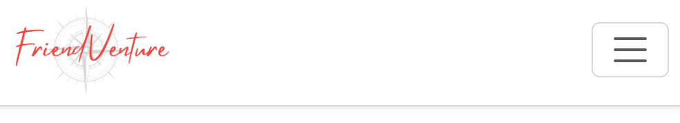<br>
  - Screenshot of header in mobile view with toggled navigation:<br>
  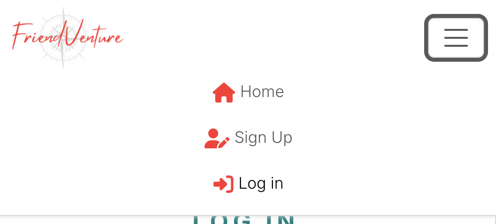<br>
  - Screenshot of header on larger screens:<br>
  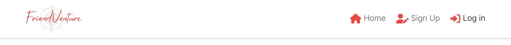<br>

  
  View for users who are logged in:<br>
  - Screenshot of header in mobile view:<br>
  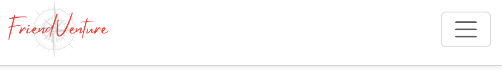<br>
  - Screenshot of header in mobile view with toggled navigation:<br>
  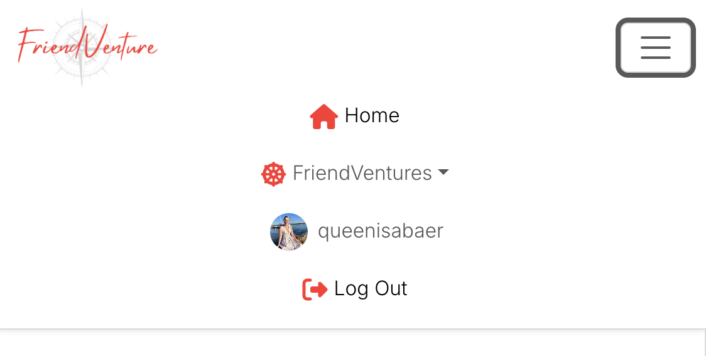<br>
  - Screenshot of header in mobile view with dropdown in toggled navigation:<br>
  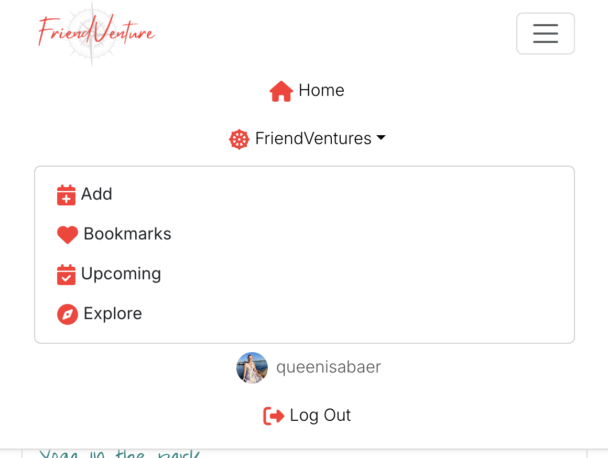<br>
  - Screenshot of header in desktop view:<br>
  <br>
  - Screenshot of header in desktop view with dropdown:<br>
  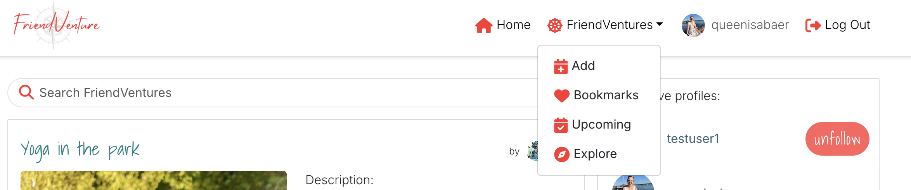<br>


</details>

<details>
<summary> Favicon & Title</summary>
<br>

To create a consistent appearance, the logo, which appears in a rectangular form in the navigation bar, was adapted into a square version to create the favicon. A fitting title was also added to maintain consistency in the overall design.<br>
Screenshot of the favicon:<br>
<br>

</details>

<details>
<summary> Home page </summary>
<br>

<br>
In the wireframe, a different approach can be seen. Due to a lack of time, I wasn't able to implement the functionality, so that 
 <br>

Screenshot for the home page:<br>
<br>
Screenshot of the home page after log in: <br>
<br>


</details>

<details>
<summary> User authentication </summary>
<br>

The user authentication system is implemented using the [dj-rest-auth](https://dj-rest-auth.readthedocs.io/en/latest/) framework, ensuring secure and reliable access to the site. This feature includes standard registration, login, and logout processes, with error handling and feedback tailored to match the application's design.<br> 

**Sign Up**<br>
Users who are new to the site or have not yet created an account, can select the "Sign up" option from the Navigation Bar to register for a new user account. This process utilizes the standard dj-rest/auth/registration method for user account creation. Error messages for the username and password fields have been customized to match the application's color scheme. After properly registering, the user will be redirected to the login page and a success message will be displayed for two seconds.<br>
Screenshot for Sign Up: <br>
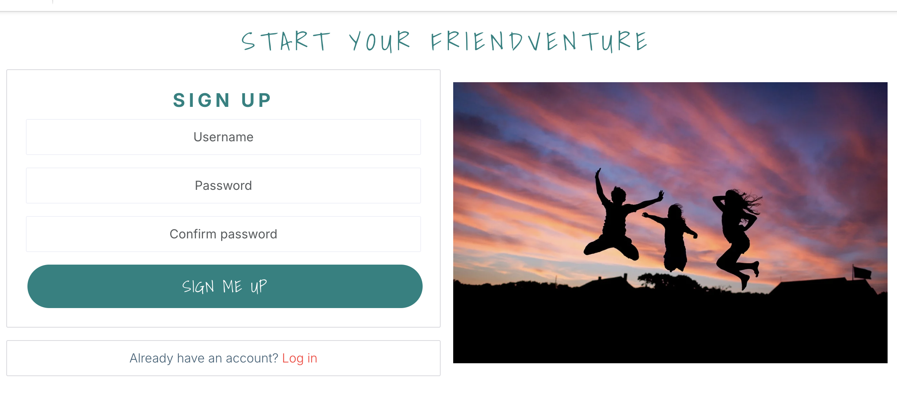<br>
Screenshot for Sign Up with Error message for username: <br>
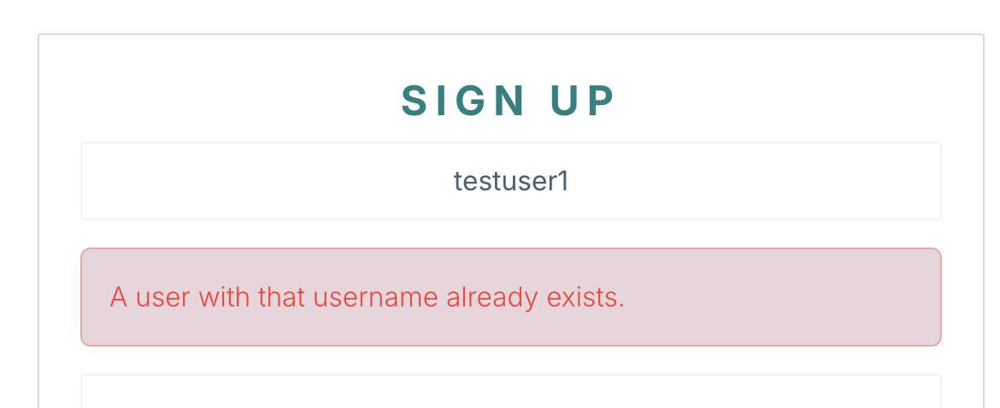<br>
Screenshot for Sign Up with Error message for password: <br>
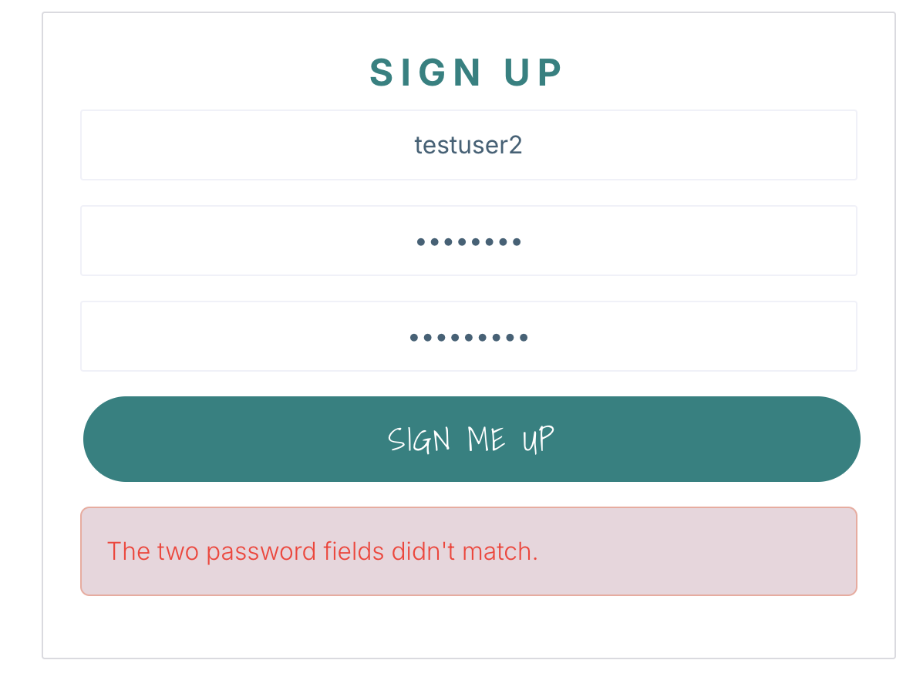<br>
Screenshot of success message after properly registration: <br>
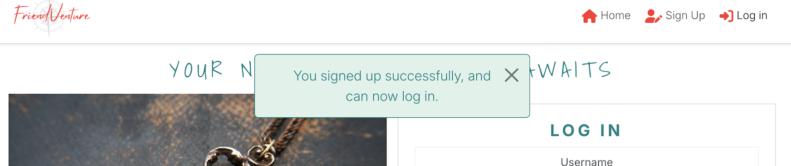<br>

**Log in** <br>
Users who already have an account can click on the "Login" option in the Navigation Bar to access their account. This page utilizes the standard dj-rest/auth/login method for user authentication. Error messages for the username and password fields have been customized to match the application's color scheme. After the user correctly logs in, a success message is displayed for 2 seconds, and the user is redirected to the homepage, where an overview of all created FriendVentures is shown.<br>
Screenshot for Log In: <br>
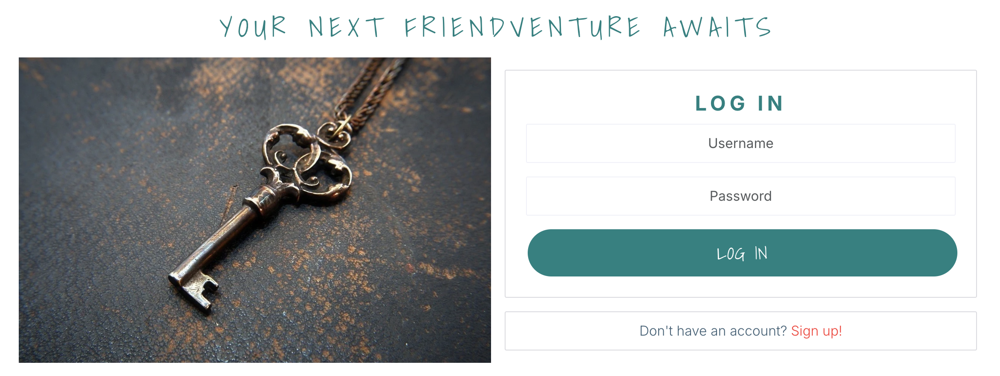<br>
Screenshot for Log In with error message: <br>
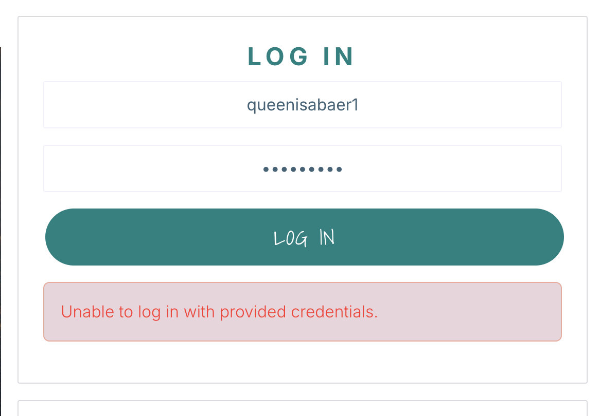<br>
Screenshot of success message after properly log-in: <br>
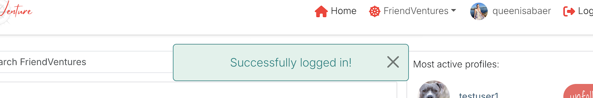<br>

**Log Out**<br>
To log out, the user simply needs to click on the "Log Out" option in the menu. Upon doing so, the user is successfully logged out via the /dj-rest-auth/logout/ endpoint, is redirected to the log-in page, and a success message is displayed.<br>
Screenshot for Log out success message <br>
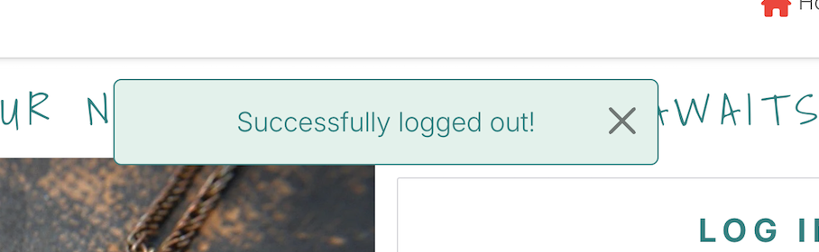<br>

</details>


<details>
<summary> User Profile </summary>
<br>

The user can access their profile only if logged-in through the navigation bar, from the "Most Active Profiles" section (if they are listed there), the participants or comments section by clicking on their username or profile picture. <br>

The profile contains the following components:<br>
**Profile Picture**: If the user hasn’t uploaded a picture, a placeholder image featuring the cute ghost that appears throughout the site is shown.<br>
**Username**: The username that the user created during the signup process.<br>
**Follow/Unfollow button**: This button appears only if the user being viewed is not the currently logged-in user.<br>
**Overview of FriendVentures**: Displays the number of FriendVentures the user has currently created.<br>
**Followers and Following Counts**: Shows how many people are following the user and how many people the user is following.<br>
**"That's Me" Description**: A personal description if the user has filled it out.<br>
**Contact Information (Reach out)**: A section where the user can provide their phone number and email address. If these are not provided, a placeholder text is displayed.<br>
When a user creates a FriendVenture, the FriendVenture count on their profile increases. If the user follows or unfollows another user, the followers count on their profile will increase or decrease accordingly. Similarly, if another user follows or unfollows them, the following count will be updated. Additionally, the follow/unfollow button will change to reflect the current following status.
Below these components, there is an overview of all the FriendVentures the user currently has online.If the user has created more than 10 FriendVentures, additional FriendVentures will continue to load as the user scrolls down (infinite scroll functionality). During this process, a spinner is briefly displayed to indicate that more content is being loaded.<br>
When a user visits their own profile, three dots outlined in green appear on the right side. Clicking on these dots reveals a dropdown menu where the user can edit their profile, username, or password. Each option redirects the user to the corresponding form page for making the desired changes. <br>
When editing their profile, the user must ensure that the profile picture does not exceed 2 MB in size. Additionally, the phone number field must contain numerical values, and the email field must have a valid email address.<br>
<br>

Screenshot of profile page(desktop view) after signing up:<br>
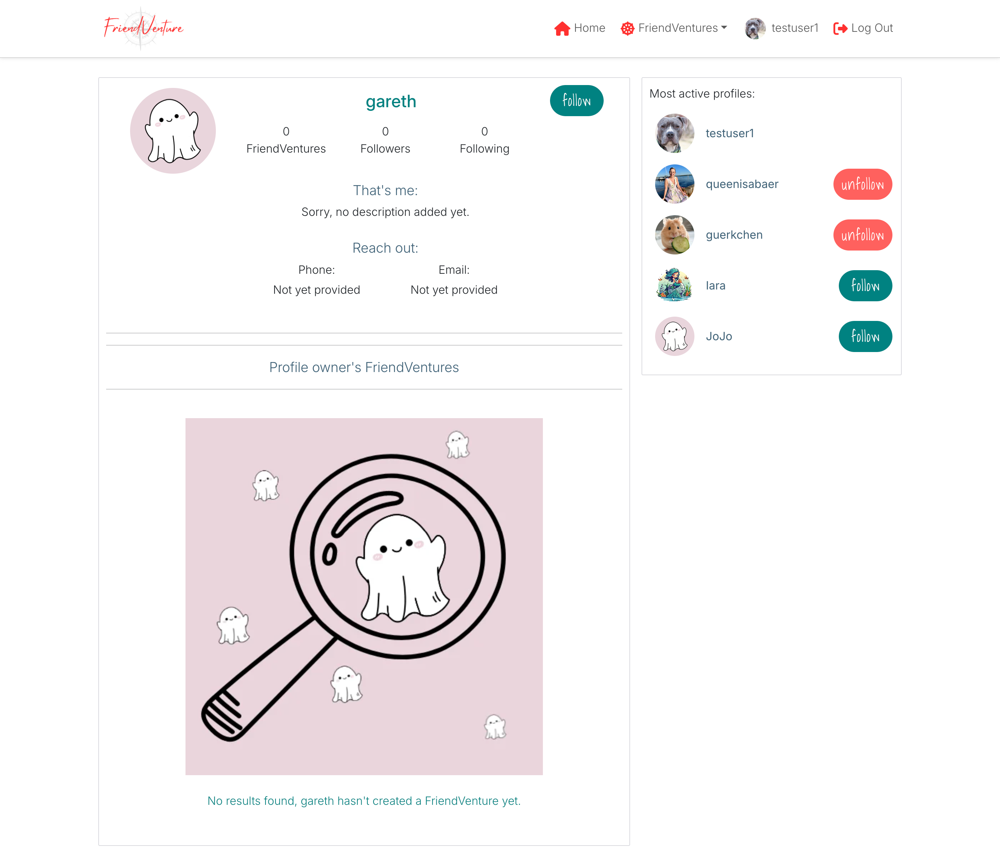<br>
Screenshot of profile page(mobile):<br>
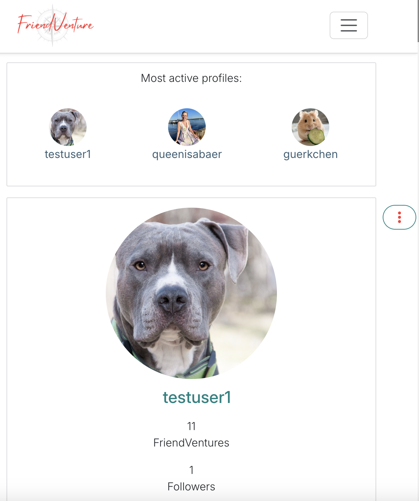<br>
Screenshot of profile page(desktop):<br>
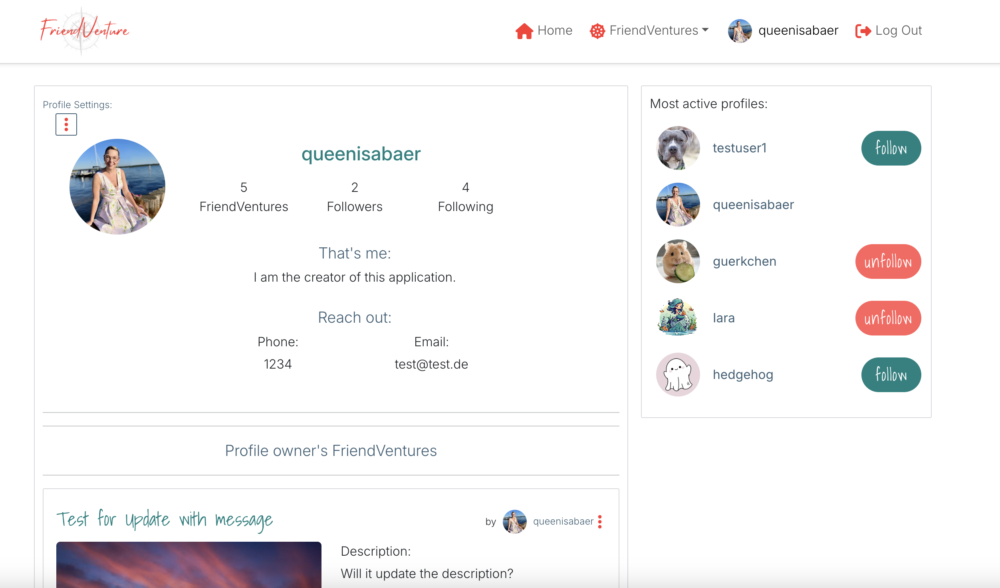<br>

**Edit a profile**<br>
Screenshot of profile page with edit menu(desktop):<br>
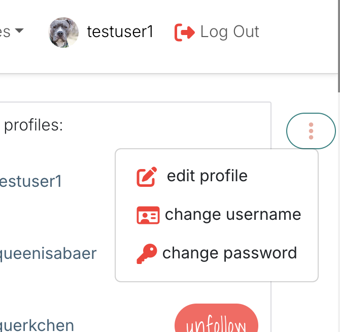<br>
Screenshot of profile page with edit menu(mobile):<br>
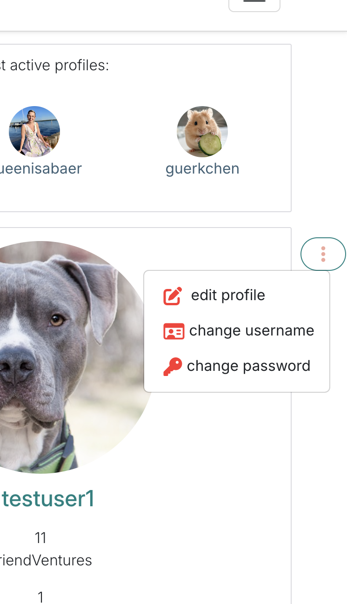<br>
Screenshot to edit the profile page and success message after editing:<br>:
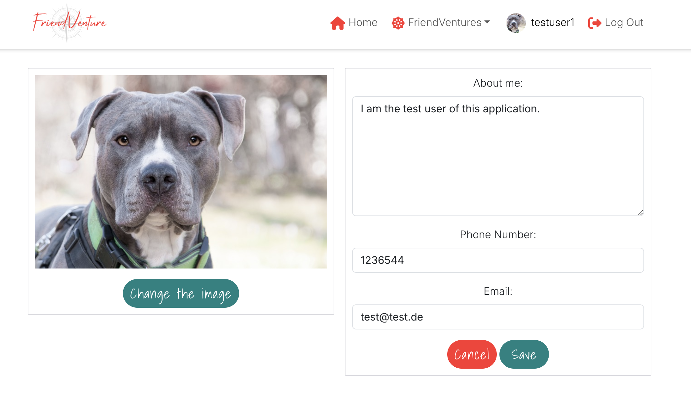<br>
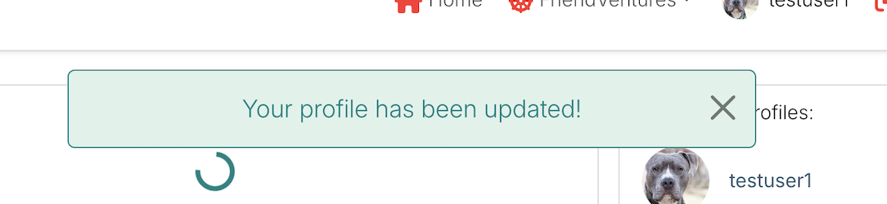<br>
Screenshot of error messages:<br>:
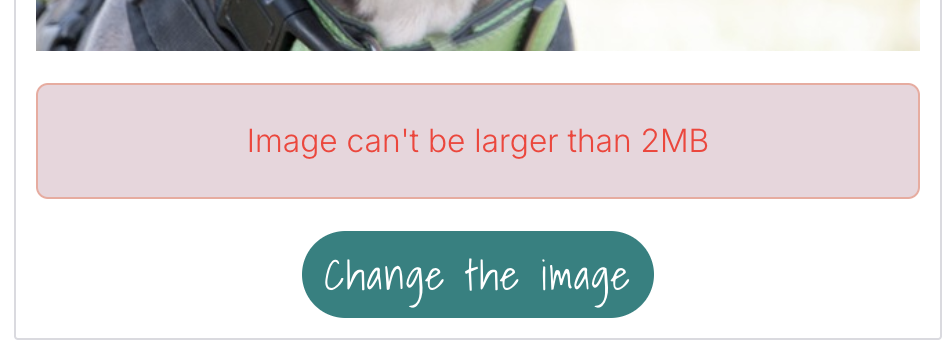<br>
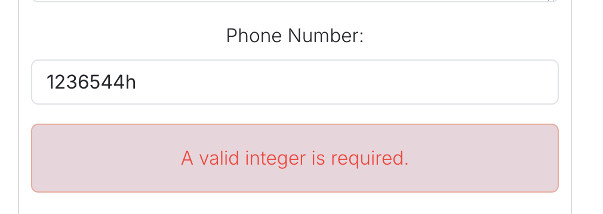<br>
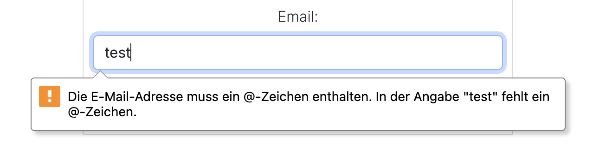<br>

**Edit username** <br>
Screenshot of edit username page:<br>
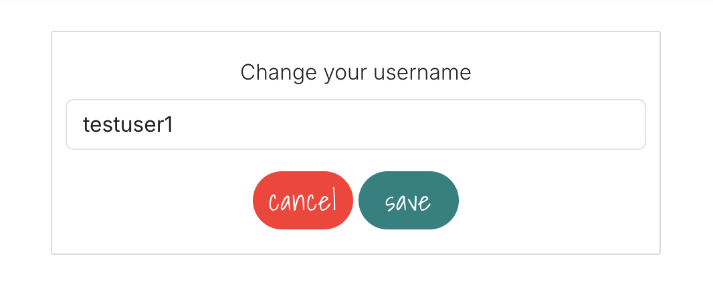<br>

**Edit password**<br>
Screenshot of edit password page:<br>
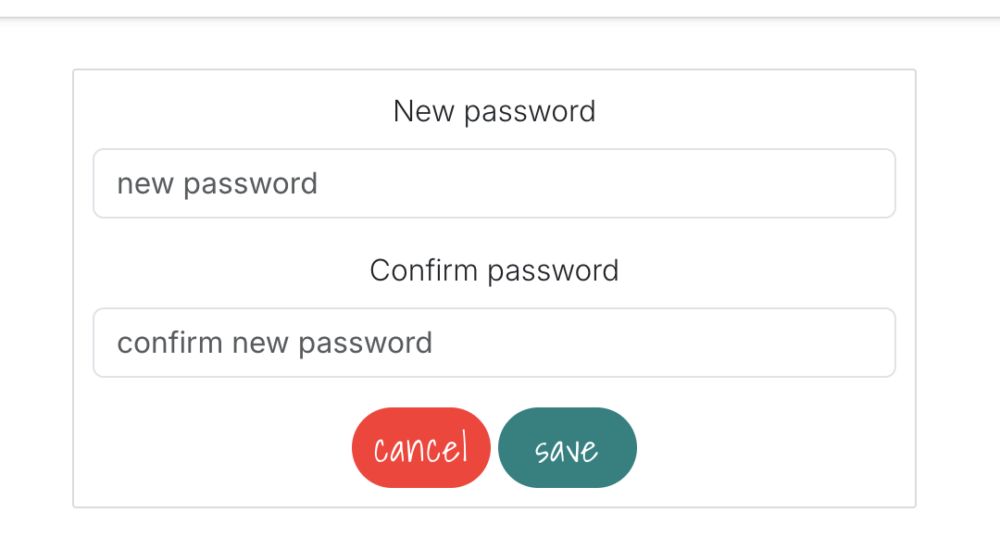<br>

</details>

<details>
<summary> FriendVenture Management</summary>
<br>
xxx
The FriendVenture Management includes the following topics: Adding a new FriendVenture, FriendVenture detail view, Editing or deleting an existing FriendVenture, displaying an overview of all existing FriendVentures on profile page. <br>

 - **Adding a new FriendVenture**<br>
xxx
To add a FriendVenture, the user must sign up or log in. Then they can go to the associated page via the navigation bar. Except the description all form fields are required. The date must be today or in the future. <br>
After the user has clicked the 'create' button, they will be redirected to the home page, and a success message is shown to the user. The creator of a FriendVenture is automatically a participant in the FriendVenture.<br>
<br>

Screenshot of 'add a FriendVenture' page:<br>
<br>
Screenshot of success message:<br>
<br>

- **FriendVenture detail view**<br>
xxx
A FriendVenture contains several elements in the detailed view. 
The following elements are included for the owner of the list: <br>
<br>

Screenshot of FriendVenture detail page for owner of the list:<br>
<br>
<br>

- *Edit* (Pencil Icon & _Edit_) : Leads to the page for editing the FriendVentures.<br>
- *Delete* (Trash Icon & _Delete_): Allows the user to delete the FriendVenture. This action requires a confirmation step(opens in a new modal) to complete the deletion.<br>
<br>

- **Edit a FriendVenture**<br>
xxx
As part of the full CRUD functionality, the FriendVenture owner has the ability to edit the FriendVenture. <br>

Screenshot of edit page<br>
<br>
Screenshot of message:<br>
<br>


- **Delete a FriendVenture**<br>
As part of the full CRUD functionality, the FriendVenture owner can delete a FriendVenture. This can be achieved from the FriendVenture overview by clicking on the three dots as well as from the detail page of the FriendVenture. The user must confirm that he actually wants to delete the FriendVenture in a modal. After successful deletion, the user is redirected back to the homepage and the corresponding FriendVenture is deleted from the database and the overview.<br>

Screenshot of delete confirmation modal<br>
<br>
Screenshot of message if user is not owner:<br>
<br>


- **Displaying an overview of all existing FriendVentures on the Homepage.**<br>
xxx
The user can access the overview page of all FriendVentures that have been created by clicking on the homepage link in the navigation bar (Home), or by clicking on the logo. These FriendVentures are sorted by the date they were added. Each FriendVenture is displayed in a card format that includes the FriendVenture's title, the description the date, the time, the location, the category, by whom the Friendventure was created, how many participants, bookmarks and comments it has and when the FriendVenture was last updated.

 that leads to the detailed view of the FriendVenture. 
 When clicking the three dots it opens a
 
 , there are two buttons with icons:<br>


Screenshot of FriendVenture overview page <br>
<br>

- **Displaying an overview of bookmarked FriendVentures**<br>
xxx

- **Displaying an overview of upcoming FriendVentures(as Participant)**<br>
xxx

- **Displaying an overview of all FriendVentures created by user**<br>
xxx


</details>

<details>
<summary> User Interaction </summary>
<br>

An error page for the common error 404 has been created and includes a xxx <br>
<br>

</details>

<details>
<summary> 404 - Not Found page </summary>
<br>

An error page for the common error 404 has been created and includes a xxx <br>
<br>

</details>

 
<details>
<summary> Redirect functionality for the user depending on loggedin or loggedout status </summary>
<br>
The application includes a redirect functionality to manage user access based on their logged-in or logged-out status. If the user is logged in, they cannot access the Signup or Login pages, even by typing the URL directly in the browser; any attempt to do so will automatically redirect them to the homepage. Conversely, if the user is logged out, they are restricted from accessing the user profile page, the detail page of a FriendVenture, or interacting with FriendVentures (such as bookmarking, commenting, or participating). In such cases, the user is always redirected to the homepage.
<br>

</details>

### Features, which I would like to implement in the future NEEDS UPDATE

- Delete a profile
- 

## Bugs NEEDS UPDATE

<details>
<summary> xxx </summary>
<br>
xxx 
<br>
<br>

<br>
<br>

</details>

<details>
<summary> xxx </summary>
<br>
xxx
<br>
<br>

<br>
<br>

</details>


## Technologies Used NEEDS UPDATE

### Languages:
- [CSS](https://en.wikipedia.org/wiki/CSS)
- [JavaScript](https://www.javascript.com/)
- [Python](https://en.wikipedia.org/wiki/Python_(programming_language))

### Tools:
- [Git](https://git-scm.com/) was used for version control by utilizing the Gitpod terminal to commit to Git and Push to GitHub.
- [GitHub](https://github.com/) was used to save and store the files for the website.
- [Heroku](https://www.heroku.com) was used to deploy the application.
- [CodeInstitute IDE - Gitpod](https://codeinstitute-ide.net/) was used as IDE. 
- [Code Insitute Database Maker](https://dbs.ci-dbs.net/) PostgreSQL database hosting for this project
- [Fontawesome](https://fontawesome.com/) was used to add icons to the website.
- [Balsamiq](https://balsamiq.com/) was used to create the wireframes.
- [Black Formatter](https://marketplace.visualstudio.com/items?itemName=ms-python.black-formatter) to beautify the code
- [Beautifier](https://beautifier.io/) to beautify the HTML code
- [LanguageTool](https://languagetool.org/) was used to check the grammar and spelling in the README and the Code. 
- [Coloors](https://coolors.co/image-picker) was used to create the colour scheme.
- [Pixelied](https://pixelied.com/convert/jpg-converter/jpg-to-webp) was used to convert jpg images into wepb images.
- [Pixabay](https://www.pixabay.com/de-de/) was used to search and load images
- [Browserling](https://www.browserling.com/) was used to test the application on different browsers.
- [Cloudinary](https://cloudinary.com/) was used to store the item images.
- [Canva](https://www.canva.com/) was used to create the logo, and the placeholder images.
- [Favicon.io](https://favicon.io/favicon-generator/) was used to create the favicon.
- [Google Chrome Dev Tools](https://developer.chrome.com/docs/devtools?hl=de) were used to check the application for responsiveness and errors. 

### Frameworks: 
- 

### Libraries and modules:
- [os](https://docs.python.org/3/library/os.html) provides functions to interact with the operating system. 
- [sys](https://docs.python.org/3/library/sys.html) was used to get system-specific functions.
- [datetime](https://docs.python.org/3/library/time.html) supplies classes for manipulating dates and times.
- [Gunicorn](https://gunicorn.org/) provides a way to serve Python web applications.
- [Pycopg 2](https://pypi.org/project/psycopg2/) is a PostgreSQL database adapter for Python.
- [Allauth](https://docs.allauth.org/en/latest/) was used to handle user authentication, registration, and account management.
- [Crispy Forms](https://django-crispy-forms.readthedocs.io/en/latest/) is a Django application to manage and to render the forms.
- [Whitenoise](https://whitenoise.readthedocs.io/en/stable/) was used to serve static files.
- [Summernote](https://summernote.org/) as text-editor for admin panel. 
- [dj_database_url](https://pypi.org/project/dj-database-url/) enables the ability to represent their database settings via a string.
- [random](https://docs.python.org/3/whatsnew/3.12.html#random) implements a pseudo-random number generator.
- [string](https://docs.python.org/3/whatsnew/3.11.html#string) contains a collection of string operations and constants.

## Testing

The app was tested regularly and deployed early to Heroku to make sure both local and remote worked the same.

### Validator Testing NEEDS UPDATE


<details>
<summary> CSS Validation</summary>
<br>

I passed my css file through the [CSS Validator](https://jigsaw.w3.org/css-validator/) .<br>
     

  
</details>

<details>
<summary> JavaScript Validation</summary>
<br>

I passed my javaScript file through the [JSHint](https://jshint.com/). In the first attempt, three warnings were found due to two missing semicolons and the usage of the async function, which is only available in ES8. After searching on Slack, I found a useful thread by [Joanna Skoczen](https://code-institute-room.slack.com/archives/C7EJUQT2N/p1662139410703239), and used the following statement to get rid of the error: 
```//jshint esversion:8``` 
<br>
<br>
     


The statement of one undefinied variable is caused by cross referencing scripts. 
  
</details>

<details>
<summary> Python Validation</summary>
<br>

All created python files were checked with the [Code Insitute validator - CI Python Linter](https://pep8ci.herokuapp.com/#). After removing some lines that were too long, everything was clear, and no errors were found.<br>
  
</details>


### Manual Testing NEEDS UPDATE

<details>
<summary> Click here to see the testing table for features</summary>
<br>

| **Test** | **Test Description** | **Expected Outcome** | **Result** | 
|:---|:---|:---|:---|
| Header - Logo | Click on the logo to return to main page | Clicking on the logo on each page will return you to the main page | Pass |
| Header - Navbar toggle in tablet/mobile view | Click in tablet/mobile view on the burger icon to open the navigation | When the burger icon in mobile or tablet view is clicked, the navigation should open | Pass |
| Header - Close Navbar toggle in tablet/mobile view | Click outside of the toggeld navbar in tablet/mobile view | When clicking outside of the toggled navbar, the navbar should dissapear and the burger icon should be shown | Pass |
| Header - Navbar toggle inside the menu in tablet/mobile view | Click in tablet/mobile view on the burger icon to open the navigation and then click on FriendVentures | When the user clicks FriendVentures in mobile or tablet view, the dropdown should open | Pass |
| Header - Navigation link | Click on a term in the navigation bar to go to the corresponding page | Clicking on a page at the navigation bar should take the user to the corresponding page | Pass |
| Header - Navigation link (mobile view) | Click in the mobile view on a term in the navigation bar to go to the corresponding page and close the toggled burger menu | Clicking on a page at the navigation bar should take the user to the corresponding page and close the toggled burger menu | Pass |
| Header - Navigation links and items | Depending on whether the user is logged in or not, the navigation elements should adapt accordingly | After logging in, the navigation menu should adjust accordingly. | Pass |
| Favicon & Title | When opening the page or navigating within it, the favicon and the title should be visible. | After opening the page or navigating within it, tha favicon should be visible. | Pass |


| Main page - default version | Visit the website for the first time or don't be logged in to see the default version of the 'home' page | After visiting the website for the first time or if a user isn't logged in, the main page should contain a short welcome message, with two buttons to sign up or log in, and a navigation bar that only contains three elements: 'Home', 'Login' and 'Sign Up'. 'Home' should be underlined | Pass |
| Main page - Log in version | Log in to see a modified version of the 'home' page | After logging in, the 'home' page should contain a short welcome message, with two buttons to sign up or log in, and a navigation bar that contains five elements: 'Home', 'New List', 'Profile', 'Overview' and 'Logout'. 'Home' should be underlined | Pass |

| Sign Up | Fill out each field and click on the sign-me-up button. | After filling out every form field with validate input, and clicking the 'Sign Up' button, the user should be redirected to the verify email page and receive an email to verify the mail address | Pass |
| Sign Up - error message | Fill the username field with a username that is already existing or a pwassord that didn't match, and click on the sign-me-up button. | After entering a username that already exists or a password that doesn't match, and clicking the "sign me up" button, an error message should be displayed. | Pass |
| Log In | Log in with username and password | Clicking on the 'Log In' button after providing the correct username and password, the user should be redirected to the main page, and the navigation menu should change. In addition, a message that a successful login has taken place should be displayed. | Pass |
| Log out | Click 'Log out' in the navigation bar | After clicking on Log out, the user is logged out, redirected to the log in page, the navigation bar for logged out users is shown, and a message is displayed. | Pass |
| Redirect Logged In - Signup/Login | Manually enter the URL for the Signup or Login page in the browser while logged in. | The user is redirected to the homepage, and the Signup/Login page is not accessible. | Pass |
| Redirect Logged out - Profile Page | Manually enter the URL for the user profile page in the browser while logged out. | The user is redirected to the homepage, and the profile page is not accessible. | Pass |
| Redirect Logged out - FriendVenture Detail Page | Manually enter the URL for a FriendVenture detail page in the browser while logged out. | The user is redirected to the homepage, and the FriendVenture detail page is not accessible. | Pass |
| Redirect Logged out - FriendVenture Interaction | Attempt to bookmark, comment, or participate in a FriendVenture while logged out. | The user is redirected to the homepage, and the interaction is not allowed. | Pass |
| User Profile Access - Logged In | Access the profile page via the navigation bar, "Most Active Profiles" section, participants section, or comments section by clicking on the username or profile picture. | The user should be able to access their profile page. | Pass |
| Profile Picture Display | Access the profile page where the user has not uploaded a picture. | A placeholder image featuring the cute ghost should be displayed. | Pass |
| Username Display | Access the profile page. | The username displayed should be the one created during the signup process. | Pass |
| Follow/Unfollow Button Visibility | Access the profile page of a user who is not the currently logged-in user. | The follow/unfollow button should be visible. Access the profile page of the logged-in user. | The follow/unfollow button should not be visible. | Pass |
| Overview of FriendVentures | Access the profile page. | The number of FriendVentures the user has created should be displayed accurately. | Pass |
| Followers and Following Counts | Access the profile page. | The number of followers and the number of people the user is following should be displayed accurately. | Pass |
| "That's Me" Description | Access the profile page where the user has provided a description. | The description should be displayed if it is filled out. If not, the field should be show placeholder text. | Pass |
| Contact Information (Reach Out) | Access the profile page. | Phone number and email address fields should display the user's information if provided. If not provided, placeholder text should be displayed. | Pass |
| Infinite Scroll for FriendVentures | Access a profile page with more than 10 FriendVentures and scroll down. | Additional FriendVentures should load as the user scrolls, and a spinner should be briefly displayed during loading. | Pass |
| Edit Profile Button - Own Profile | Visit own profile page. | Three dots outlined in green should appear on the right side. Clicking these dots should reveal a dropdown menu with options to edit profile, username, or password. | Pass |
| Redirect to Edit Profile Page | Click on 'Edit Profile' from the dropdown menu. | The user should be redirected to the edit profile page with existing data pre-filled in the form. | Pass |
| Confirm Profile Changes | On the edit profile page, click 'Confirm Changes'. | The user should be redirected back to the profile overview page, and a success message should be displayed for 3 seconds. | Pass |
| Profile Picture Size Validation | On the edit profile page, upload an image larger than 2 MB. | The system should reject the upload with an appropriate error message. | Pass |
| Phone Number Field Validation | On the edit profile page, enter non-numeric characters in the phone number field. | The system should reject the input with an appropriate error message. | Pass |
| Email Field Validation | On the edit profile page, enter an invalid email address. | The system should reject the input with an appropriate error message. | Pass |
| Profile Editing - Success Message and Redirect | Save all changes to the profile, and click the save button. | A success message should be displayed, and the user should be redirected to the profile page. | Pass |


| Userprofile - first view - Log in required | After successful registration, go to the profile page for the first time | The profile page should show an overview of the available data (username, email). There should be placeholder text in the fields for first and last names. | Pass |
| Userprofile Overview - Log in required | Navigate to the profile page to see profile data | The profile page should show an overview of the data given | pass |
| User Profile - edit profile page - Log in required | Click on the 'Edit your profile' button | After clicking on the 'Edit your profile' button, the user should be redirected to a page where they can edit its data. All fields of the form should already contain the existing data. | Pass |
| User Profile - confirm changes - Log in required | Click the 'Confirm Changes' button on the edit profile page | After clicking the button, the user should be redirected to the profile overview and a success message should be shown for 3 seconds | Pass |


| 'Add a new FriendVenture' page - Log in required | Click in the navigation bar on the link 'New List' or on the button 'New Wish List' to get to the 'Add a new wish list' page | After the user clicks on the button or the link, he gets to the corresponding website 'Add a new wish list' | Pass |
| 'Add a new wish list' page - Create new wish list - Log in required | Fill in all necessary fields and click on "save wish list" button | The user should be forwarded to the Wish list detail page after all fields have been filled with valid data(e.g. due date in the future) and they have clicked on the button to save the wish list. A message that the wish list has been successfully created should be displayed to the user. The wish_list_id generated in the background should be part of the URL. | Pass |
| 'Add a new wish list' page - Create new wish list with same name as existing wish list - Log in required  | Fill in all necessary fields, and give the wish list a name that is already existing, and click on "save wish list" button | The wish list should be generated with a different URL and wish_list_id | Pass |
| Wish list detailed view - Log In and ownership required | In the wish list overview, click on the button "show wish list" to get to the detailed view | After clicking on the button, the user should be redirected to the detailed view for the wish list | Pass |
| Wish list detailed view - share wish list - Log In and ownership required | Log in as the owner of the wish list, navigate to the wish list detail view, click on the "Share" button under the title | A modal opens with the link to copy. After clicking on the copy button for a brief moment, "copied" is displayed underneath the link. | Pass |
| Wish list detailed view - edit and delete buttons visibility - Log In and ownership required | Log in as the owner of the wish list, navigate to the wish list detail view | "Edit" and "Delete" buttons are visible below the title | Pass |
| Wish list detailed view - display details of wish list | Navigate to the wish list detail view | All details (name, due date, etc.) are displayed below the "Edit" and "Delete" buttons | Pass |
| Wish list detailed view - purchase link is only shown if provided and opens in a new tab | Navigate to the wish list detail view and click on the purchase link, if it is displayed | The purchase link should only be displayed if the user has provided one. After clicking on the purchase link, a new tab should open | Pass |
| Wish list detailed view - display Items in 'Wishes' section, sorted by priority | Navigate to the wish list detail view | Items are displayed in cards with provided data (image, name, price, priority, quantity, link if given) and sorted by priority | Pass |
| Wish list detailed view - no items message - Log In and ownership | Log in as the owner of the wish list, navigate to the wish list detail view with no items added | A note is displayed under the 'Add a Wish' button, alerting the user that no items have been added yet | Pass |
| Wish list detailed view - no items message - external user | Log in as the owner of the wish list, navigate to the wish list detail view with no items added | A note is displayed under the heading *Wishes*, alerting the user that no items have been added yet by the owner of the wish list | Pass |
| Wish list detailed view - Add a Wish Button Functionality - Log In and ownership required | Log in as the owner of the wish list, navigate to the wish list data | A modal opens to allow the addition of new items | Pass |
| Wish list detailed view - Link to Wish List Overview - Log In and ownership required | Log in as the owner of the wish list, navigate to the wish list detail view | A link is displayed below the wishes to return to the overview of all wish lists | Pass |
| Wish list detailed view - Timestamp Display | Log in as the owner of the wish list, navigate to the wish list detail view | A timestamp in the lower-right corner shows the last edited date and time | Pass |
| Wish list detailed view - View Wish List as Non-Owner | Open the wish list link as a non-owner | The wish list displays the name, details, wishes included, and the last updated timestamp without the "Share," "Edit," and "Delete" buttons and the link to display the wish lists overview | Pass |
| Edit wish list from overview page | Log in as the owner of the wish list, navigate to the wish list overview page, click the "pen" button | User should be redirected to the edit form page with fields containing previous data | Pass |
| Edit wish list from detail page | Log in as the owner of the wish list, navigate to the wish list detail page, click the "Edit" button |  User should be redirected to the edit form page with fields containing previous data | Pass |
| Edit wish list - Confirm Changes | Log in as the owner of the wish list, navigate to the wish list edit form page, make changes, and click "Confirm Changes" button | User is redirected back to the overview page with a success message indicating the wish list has been changed | Pass |
| Edit wish list -  Prevent unauthorized URL access for editing | Open the wish list edit URL without logging in  | Redirected to the login page with a message indicating the need to log in first to edit a wish list | Pass |
| Edit wish list - Unauthorized User Receives 403 Error  - Log in required | Log in as a user who is a non-owner of a wish list, attempt to edit a wish list by entering the edit URL | Receive a 403 Forbidden page indicating they are not authorized to edit the wish list | Pass |
| Delete a wish list from overview page | Log in as the owner of the wish list, navigate to the wish list overview page, click the "trash can" button | User should be redirected to the confirm deletion form page | Pass |
| Delete a wish list from detail page | Log in as the owner of the wish list, navigate to the wish list detail page, click the "Delete" button |  User should be redirected to the confirm deletion form page | Pass |
| Delete a wish list - Confirm deletion and redirect to overview | Click on the 'Confirm Deletion' button | After clicking on the "Confirm Deletion" button, the user should be redirected to the wish list overview page | Pass |
| Delete wish list -  Prevent unauthorized URL access for editing | Open the wish list delete URL without logging in  | Redirected to the login page with a message indicating the need to log in first to delete a wish list | Pass |
| Delete a wish list - Unauthorized User Receives 403 Error - Log in required | Log in as a user who is a non-owner of a wish list, attempt to delete a wish list by entering the delete URL | Receive a 403 Forbidden page indicating they are not authorized to delete the wish list | Pass |
| Add item - open modal - Log In and ownership of wish list required | Log in as the owner of the wish list, navigate to the wish list detail page, click on the "Add item" button | The add item modal opens with a form | Pass |
| Add Item with Valid Details - Log In and ownership of wish list required | Log in as the owner of the wish list, open the add item modal, fill in the item name, price (within the limit), quantity, priority, and optionally select a different image, then click on the "Add item" button | The item is added as a new card in the wishes overview, and a success message is displayed | Pass |
| Add item with price over €1000 - Log In and ownership of wish list required | Log in as the owner of the wish list, open the add item modal, fill in the item name, set the price over €1000, fill in the other mandatory fields, and click on the "Add item" button | An error message is displayed indicating the price limit, and the item is not added | Pass |
| Add item with quantity over 100 - Log In and ownership of wish list required | Log in as the owner of the wish list, open the add item modal, fill in the item name, set the quantity over 100, fill in the other mandatory fields, and click on the "Add item" button | An error message is displayed indicating the quantity limit, and the item is not added | Pass |
| Add item with default quantity, priority and image - Log In and ownership of wish list required | Log in as the owner of the wish list, open the add item modal, fill in the item name and price within the limit, leave the quantity, the priority and the image field at their default values, and click on the "Add item" button | The item is added with the default quantity of 1, a priority  of _no-priority_ and the default image as a new card in the wishes overview, and a success message is displayed | Pass |
| Add item - change default image - Log In and ownership of wish list required | Log in as the owner of the wish list, open the add item modal, fill in the mandatory fields, select a different image from the local machine, and click on the "Add item" button | The item is added with the selected image as a new card in the wishes overview, and a success message is displayed | Pass |
| Add item - alt text of default image - Log In and ownership of wish list required | Log in as the owner of the wish list, open the add item modal, add an item with the default image, and inspect the added item card | The default image description (alt text) for this image is "item image" | Pass |
| Add item - error message for empty mandatory fields - Log In and ownership of wish list required | Log in as the owner of the wish list, open the add item modal, leave item name, price, quantity, and priority fields empty, and click on the "Add item" button | Error messages are displayed indicating the mandatory fields that need to be filled, and the item is not added | xxx |
| Add item - success message and redirect to wishlist detail page with new card after adding item - Log In and ownership of wish list required | Log in as the owner of the wish list, open the add item modal, fill in the mandatory fields, and click on the "Add item" button | The item is added as a new card in the wishes overview, and a success message is displayed | Pass |
| Wish list overview page - Access overview page - Log in required | Log in as owner of wish lists, click on the "Wish Lists Overview" link in the navigation bar or navigate to the profile page, and click on the "Show your wish lists overview" button| The wish list overview page is displayed, showing only the user's wish lists sorted by the date they were added | Pass |
| Wish list overview page - display user's wish lists - Log in required| Log in as owner of wish lists, navigate to the wish list overview page | Only the wish lists created by the logged-in user are displayed, each in a card format with the title, due date, "Show wish list" button, and two buttons with icons | Pass |
| Wish list overview page - Sort Wish Lists by Date Added - Log in required | Log in as owner of wish lists, navigate to the wish list overview page | Wish lists are displayed in the order they were added, from newest to oldest | Pass |
| Wish list overview page - Show wish list button - Log in required | Log in as owner of wish lists, navigate to the wish list overview page, click on the "Show wish list" button on a wish list card  | The detailed view of the selected wish list should be displayed | Pass |
| Wish list overview page - Edit button functionality - Log in required | Log in as owner of wish lists, navigate to the wish list overview page, click on the edit button (pencil icon) on a wish list card | The page for editing the selected wish list should be displayed. | Pass |
| Wish list overview page - Delete button functionality - Log in required | Log in as owner of wish lists, navigate to the wish list overview page, click on the delete button (trash can) on a wish list card | A page to confirm the deletion should be displayed. | Pass |
| Wish list overview page - No wish lists message - Log in required | Log in as the user with no wish lists created, navigate to the wish list overview page | A message is displayed: "Seems like you don't have a wish list yet. Click here to create your first one." The message includes a link to add a new wish list.| Pass |
| Wish list overview page - Create Wish List Link - Log in required | Log in as the user with no wish lists created, navigate to the wish list overview page, click on the "Click here to create your first one" link  | The page to create a new wish list is displayed | Pass |
| Wish list overview page - wish list card format | Log in as the user, navigate to the wish list overview page | Each wish list is displayed in a card format including the title, due date, and "Show wish list" button. | Pass |
| Admin panel - superuser required | Navigate to the home page of the application and append /admin to it | As superuser, the admin panel should appear | Pass |
| Admin panel - Login as superuser - superuser required | Access the admin login page, enter a valid superuser username and password, click the "Log in" button | The admin dashboard is displayed | Pass |
| Admin panel - Try to access the admin area without superuser privileges - superuser required | Log in as a regular user, access the admin URL by adding /admin to the homepage URL | An error message is displayed indicating insufficient permissions, and the user cannot access the admin dashboard | Pass |
| Admin panel - Manage user accounts - superuser required | Log in as a superuser, navigate to the user management section, add a new user, edit an existing user, delete a user. | The user accounts are correctly added, edited, and deleted, with changes reflected in the database. | Pass |
| Admin panel - Manage user accounts - superuser required | Log in as a superuser, navigate to the user management section, add a new user, edit an existing user, delete a user. | The user accounts are correctly added, edited, and deleted, with changes reflected in the database. | Pass |
| Admin panel - Manage wish lists - superuser required | Log in as a superuser, navigate to the wish lists section, add a new wish list, edit or delete an existing one. | The wish lists are correctly added, edited, and deleted, with changes reflected in the database. | Pass |
| Admin panel - Manage items - superuser required | Log in as a superuser, navigate to the items section, add a new wish list item, edit or delete an existing one. | The items are correctly added, edited, and deleted, with changes reflected in the database. | Pass |
| Responsiveness | Access the _Your Wish List Maker_ pages using a desktop browser, resize the browser window to simulate different screen sizes (e.g., mobile, tablet), and refresh the pages as needed | The page layout adjusts smoothly and remains usable without horizontal scrolling, ensuring all content (cards, buttons, text) is displayed appropriately for each screen size. | Pass |


</details>

<details>
<summary> Click here to see the testing table for User Stories</summary>
<br>

| **User Story** | **Acceptance Criteria** | **Was achieved as follows** |
|:---|:---|:---|
| #9 As a new website user, I am able to identify the website's goal so that I can decide whether to continue or leave. | The website should display a clear and concise description or tag line that communicates the website's primary purpose within the first few seconds of viewing. It should include visual elements and navigational cues that help explain the website's goal and functionality. | A home page has been created that displays a small introductory text for first time visitors or users who are not logged in. In addition, the heading, the background image, the logo and the favicon already indicate the meaning of the page. |
| #12 As a new user, I can register an account so that I can create and manage wish lists or items of other wish lists. | The registration form should include fields for username and password. The registration form should be easy to access from the landing page and before creating a new list or selecting an item of another wish list Upon successful registration, the user should see its dashboard with the created wish lists and/or reserved items | I integrated Django Allauth into my project to handle user authentication, including registration, login, and logout functionalities. By configuring the necessary settings and templates, I ensured that users can easily access the registration form from the landing page and are redirected to the home page from where they can access their dashboard displaying their wish lists upon successful registration. |
| #13 As a registered user, I want to log in to my account so that I can create, read, update and delete my wish list(s) | The login form should accept username and password and should be easy to access. After successful login, the user should be redirected to their dashboard and have the possibility to logout. | To achieve the user login functionality, I created a user login page that accepts a username and password, ensuring it is easily accessible. Upon successful login, the user is redirected to the home page, where they can effortlessly navigate to their profile. The navigation bar dynamically updates upon login, providing a clear option for the user to access the profile and to log out at any time. In addition, users can access their wish list overview directly on the home page. This page is also always accessible from the navigation list. In their wish list overview, the user has the possibility to update or delete the created wish lists. |
| #13 As a registered user, I want to manage my profile so that I can update my account. | The dashboard should include a button to update the profile. | I implemented a profile management feature by adding a profile page. On this profile page, users can easily update their information by clicking the edit button or delete their account by clicking the delete button. The profile page can be accessed by users as soon as they are logged in, both from the homepage and from the navigation bar. |
| #16 As a registered user, I want to edit my wish list so that I can update its details. | The wish list edit form should allow changes to the title, description, and occasion type. Changes should be saved and reflected in the user's dashboard and in the database. | To achieve the wish list edit functionality, I created an edit form that allows users to modify the title, description, due date, and occasion type of their wish lists. Changes made in the form are saved and immediately reflected both in the user's profile and in the database. Users can access this form from the wish list overview page, where all their wish lists are displayed, as well as from the detailed view of each individual wish list. |
| #17 As a registered user, I want to be able to delete a wish list so that I can remove outdated or unnecessary lists. | The Wishlist contains a delete button. The delete action should prompt for confirmation. Once confirmed, the wish list should be removed from the user's dashboard and removed from the database | To achieve the wish list deletion functionality, I added a delete button on both the wish list detail view and the wish list overview page. When the user clicks the delete button, a confirmation page appears, informing them that this action cannot be undone and asking for their confirmation. Upon confirmation, the wish list is removed from the user's dashboard and deleted from the database, along with all items related to the wish list. |
| #19 As a registered user, I want to edit items in my wish list so that I can update their details. | The item edit form should allow changes to the item name, description, and purchase link. Changes should be saved and reflected in the wish list. | I was unable to complete this user story due to time constraints; however, I plan to implement it in the future. This feature remains a priority and will be added to enhance the application's functionality. |
| #20 As a registered user, I want to be able to delete items from my wish list so that I can remove unwanted items | The delete action should prompt for confirmation. Once confirmed, the item should be removed from the wish list. | I was unable to complete this user story due to time constraints; however, I plan to implement it in the future. This feature remains a priority and will be added to enhance the application's functionality. |
| #23 As a registered user, I want to reserve an item of a wish list, so that no other user will purchase this. | Users should be able to mark an item in a wish list as reserved/unreserved. Reserved items should display a visual indicator | I was unable to complete this user story due to time constraints; however, I plan to implement it in the future. This feature remains a priority and will be added to enhance the application's functionality. |
| #24 As a registered user, I want to be able to collaborate on a wishlist with others so that we can collectively manage it. | Collaborators should be able to add, edit, and delete items in the shared wishlist. | I was unable to complete this user story due to time constraints; however, I plan to implement it in the future. This feature remains a priority and will be added to enhance the application's functionality. |
| #14 As a logged-in user, I want to update my profile information so that my account details are current. | The profile page should allow users to update their username and password. Changes should be saved and reflected immediately. | To meet the acceptance criteria, I created a profile page where users can update their username and password. The profile overview contains an „Edit your Profile" button that redirects to an edit page with a form pre-filled with the current data. Upon submitting the form, changes are saved immediately in the database, and the user is redirected back to the profile overview, where a success message indicates the profile has been updated. This ensures that updates are reflected immediately, and the user is informed of the successful update. |
| #9 As a frequent website user, I can easily log in to my account so that I have access to my wish lists and items I want to purchase. | "The website should display a clear and concise description or tag line that communicates the website's primary purpose within the first few seconds of view in.It should include visual elements and navigational cues that help explain the website's goal and functionality. | To achieve the user login functionality, I added a prominent login button on the homepage for easy access. Additionally, the navigation bar includes login functionality. Once logged in, users can access their wish lists, ensuring a seamless user experience. The functionality to re serve an item has yet to be implemented. |
| #15 As a user of the website, I want to create a wish list for a specific occasion so that I can organize my desired items | The wish list creation form should include fields for title, description, and occasion type. The new wish list should appear in the user's dashboard. | To achieve the wishlist creation functionality, I added a form requiring users to fill out fields for the list name, due date, description, and occasion type. These fields are mandatory to ensure the wishlist is well-organized for the specific occasion. Once the form is submitted, the new wishlist appears in the user's wish list overview. |
| #18 As a user, I want to add items to my wishlist so that I can keep track of things I want. | The item addition form should include fields for item name, description, quantity, purchase link and the possibility to reserve the item. The new item should appear in the wishlist. | To achieve the item addition functionality, I implemented a form displayed in a modal that opens when the user clicks the 'Add item' button on the wishlist detail page. The form includes mandatory fields for item name, price (limited to €1000), quantity (limited to 100), and priority. Users can also add a purchase link and upload a custom image, with a default image automatically generated if none is provided. Once the form is submitted, the new item appears in the corresponding wishlist |
| #22 As a user, I want to share my wishlist with others so that they can see my wishlist and know what I would like to have. | The sharing functionality should generate a unique link for the wishlist. The recipient of the link should be able to view the wishlist without logging in. | To achieve the wishlist sharing functionality, I integrated a share button on the wishlist detail view. Clicking this button opens a modal displaying a unique link for the wishlist, along with a copy button. When the copy button is clicked, a "copied" confirmation briefly appears beneath the link. This link allows recipients to view the wishlist details without needing to sign up or log in. Additionally, the shared view restricts any modifications, preventing the addition, deletion, or editing of items on the wishlist. |
| #10 As a developer, I want to define a database structure so that it matches the objectives of the project. | Modelling the database schema visually | To achieve the objective of defining a database structure that aligns with the project's goals, I visually modelled the database schema using dbdiagram.io. This involved creating an Entity-Relationship Diagram (ERD) to plan the models for WishList, Item, User, and UserProfile. The ERD provided a clear and organized representation of the relationships between these entities. |
| #11 As a developer, I want to set up and configure a database so that I can store and manage the application data securely and efficiently. | Choose an appropriate database for the project. Define models representing the data structure required by the application. Ensure database credentials are stored securely | I chose PostgreSQL, provided by Code Institute, as the relational database for the project. I defined the necessary models to represent the application's data structure, ensuring they align with the project's requirements. |
| #25 As a developer, I need to verify that all HTML files pass the W3C validation so that the code is executed correctly | When I pass my code into the validator, no errors are thrown. | To ensure that all HTML files pass W3C validation and execute correctly, I used the Nu Html Checker to check each HTML file I created or updated. By passing all my HTML code via link or text input through the validator, I confirmed that no errors were present. |
| #26 As a developer, I need to verify that my CSS files pass the W3C validation so that the code is executed correctly | When I pass my code into the validator, no errors are thrown | To ensure that my CSS file passes W3C validation and execute correctly, I used the W3C CSS Validation Service. By validating my CSS code through this service, I confirmed that no errors were present. |
| #27 As a developer, I need to verify that my JavaScript files pass the JSHint validation so that the code is executed correctly | When I pass my code into the validator, no errors are thrown | To ensure that my JavaScript file passes JavaScript validation and execute correctly, I used JSHint to check my JavaScript file. By running my code through JSHint, I confirmed that no errors were present. |
| #28 As a developer, I need to verify that my python files pass the pep8 validation so that the code is executed correctly | When I pass my code into the validator, no errors are thrown. | To ensure that all Python files pass PEP8 validation and execute correctly, I used the CI Python Linter provided by Code Institute. After addressing issues such as removing lines that were too long, I confirmed that no errors were present. |
| #29 As a developer, I want to implement python test procedures so that I can assess functionality, usability, responsiveness and data management throughout the web application. | All critical functionalities of the web application are covered by test cases. All tests are well documented | To ensure the functionality, usability, responsiveness, and data management of the web application, I conducted comprehensive manual testing. Although I didn't have time to implement automated tests, I thoroughly tested all critical functionalities of the project manually. Each test case was documented to ensure all aspects of the application were covered and performed as expected. |
| #30 As a developer, I want to implement JavaScript test procedures so that I can assess functionality, usability, responsiveness and data management throughout the web application. | All critical functionalities of the web application are covered by test cases. All tests are well documented | As a developer, I aimed to assess the functionality, usability, responsiveness, and data management of the web application through JavaScript test procedures. While I didn't have the opportunity to implement automated tests, I conducted thorough manual testing to ensure all critical functionalities were covered by test cases. Each test was meticulously documented to verify the application's performance and adherence to requirements. |
| #31 As a developer, I want to implement manual test cases so that I can assess functionality, usability, responsiveness and data management throughout the web application. | Document manual test cases for functionalities that require human assessment. All tests are well documented | To ensure thorough evaluation of functionality, usability, responsiveness, and data management across the web application, I implemented comprehensive manual test cases. I carefully documented these test cases, covering various functionalities that require human assessment. This involved creating a detailed manual test table that systematically evaluated each aspect of the application to ensure all requirements were met and properly documented. |


</details>

### Automated Testing NEEDS UPDATE
Originally, automated tests (e.g. with jest and unittes) were planned. Unfortunately, I did not have enough time in this version to perform the corresponding tests. However, this is intended for future versions. 
Examples of automated tests:
- Ensure wish list and wish list item models are correctly defined and behave as expected. Test relationship between them.
- Verify that forms handle data correctly
- Ensure views return the correct pages in project
- Test CRUD operations on wish list
- Test rendering of components like wish list details
- Test adding and removing items from the wish list.
- Test opening and closing modals
- Test error handling for failed requests 

### Browser Compatibility NEEDS UPDATE
  The tests were conducted using the following browser:

- Google Chrome Version 128.0.6613.113 <br>
Tests were also carried out for the following browsers using [browserling](https://www.browserling.com/) <br>
- 

## Deployment

### Heroku
This site is deployed using Heroku. To deploy it from its GitHub repository to Heroku, I took the following steps:

1. Create a list of requirements in the requirements.txt file by using the command _pip3 freeze > requirements.txt_
2. Log in (or sign up) to Heroku
3. Click on the _New_ button and select _Create new app_
4. Give it a unique name and choose the region _Europe_
5. Click the *Deploy* tab, go to the _Deployment method_ section, select _GitHub_ and confirm this selection by clicking on the _Connect to Github_ button
6. Search for the repository name on github _friendventure_ and click the _Connect_ button
7. Inside the src folder add an api folder and create an axiosDefault.jsx
8. Add the link to the deployed version of the api as baseURL
9. Create a _Procfile_ in the root directory and add *web: npm run start*
10. In Heroku enable the automatic deploy or manually deploy the code from the main branch

To see the [view of the live site](https://friendventure-702f1b6ed9cf.herokuapp.com/) click on the _Open app_ button in the top right corner or, if you enabled automatic deploy (step 10), log in to GitHub, navigate to the repository for this project by selecting [*queenisabaer/friendventure*](https://github.com/queenisabaer/friendventure), click on _Deployment_ and choose in the _Environments_ section _friendventure_. On top of the latest deployment is the link to the [live site](https://friendventure-702f1b6ed9cf.herokuapp.com/).<br>

### Forking this GitHub repository
1.  Log in to GitHub.
2.  Navigate to the repository for this project by selecting [*queenisabaer/friendventure*](https://github.com/queenisabaer/friendventure)
3. Click at the top of the repository on the **Fork** button on the right side

### Clone this repository
1. Log in to GitHub.
2. Navigate to the repository for this project by selecting [*queenisabaer/friendventure*](https://github.com/queenisabaer/friendventure)
3. In the top-right corner, click on the green *Code* button
4. Copy the HTTPS URL in the tab *Local*
5. Go to the code editor of your choice and open the terminal
5. Type `git clone` and paste the URL you copied into your terminal
6. Press the enter key

## Credits

### Content

- The background image was found at Pixabay and was created by [blickpixel](https://pixabay.com/de/photos/geschenk-p%C3%A4ckchen-%C3%BCberraschung-548296/)

### Code

- A great help and inspiration was the [*Django Recipe Sharing Tutorial*](https://www.youtube.com/playlist?list=PLXuTq6OsqZjbCSfiLNb2f1FOs8viArjWy) by Daisy Mc Girr. I especially used her help with the authentication and the class-based views. 
- How to base field on another field by overwriting the save method, was found in an article in [Medium by Marco](https://marcolcl.medium.com/custom-django-model-field-based-on-default-primary-key-d5d13dd61a1c)
- To override important CSS from bootstrap, I found a great article at [StackOverflow](https://stackoverflow.com/questions/70315624/how-to-add-remove-important-css-with-new-css)
- How to redirect to the login template page with a message was found at [StackOverflow](https://stackoverflow.com/questions/39900679/django-permissionrequiredmixin-redirect-to-login-template-with-message)
- How to get the current URL with a Django template (for the modal to share a link) was found at [StackOverflow](https://stackoverflow.com/questions/2882490/how-to-get-the-current-url-within-a-django-template)
- How to copy to the clipboard with JavaScript was found [here](https://sentry.io/answers/how-do-i-copy-to-the-clipboard-in-javascript/) and at [Stack Overflow](https://stackoverflow.com/questions/400212/how-do-i-copy-to-the-clipboard-in-javascript)
- How to keep a modal window open if a validation error is raised was found at [reddit](https://www.reddit.com/r/django/comments/4souit/how_to_keep_a_modal_window_open_if_a_validation/)
- How to override the get queryset method was found at [StackOvervflow](https://stackoverflow.com/questions/62976955/how-to-override-get-queryset-in-django)
- The following websites were used as a source of knowledge: <br>
  - [Google](www.google.com)
  - [mdn](https://developer.mozilla.org/en-US/)
  - [W3C](https://www.w3.org/)
  - [W3schools](https://www.w3schools.com/)
  - [DevDocs](https://devdocs.io/)
  - [Stack Overflow](https://stackoverflow.com/)
  - [reddit](https://www.reddit.com/)
  - [forum djangoproject](https://forum.djangoproject.com/)
  - Documentation for Bootstrap, Crispy Forms, Django
  - Slack Community

### ReadMe

- Still, a big thank you to [Kera Cudmore](https://github.com/kera-cudmore) and all of her tips on what makes a good README.

### Acknowledgments

- I would like to express my deepest gratitude to my excellent mentor Brian Macharia for his numerous tips and wonderful assistance during the creation of this project, especially his help with adding items to the wish list.  
- A big thank you to [Dennis Schenkel](https://github.com/DennisSchenkel) for all his help on this project, be it brainstorming sessions to refine the code or emotional support. 
- In addition, my sincerest gratitude goes out to [Niclas Hugdahl](https://github.com/NiclO1337), [Tomas Kubancik](https://github.com/tomik-z-cech) and [MilenTecle](https://github.com/MilenTecle). Their projects were a great source of inspiration.
- Furthermore, I would like to thank [Lino Bollansee](https://github.com/linobollansee). I greatly appreciate his frequent comments during the creation of my project.

**This is for educational use.**


features: 
owner of friendventure is always participant
success messages 
datetime


Bugs: 
- time (was undefinied, had to update friendventure.jsx)
- currentUser tokens
- update image wasn't working. got an cors property error. forget trailing slash


content: 
Issue with Dropdown menu in mobile view: [here](https://stackoverflow.com/questions/60373789/react-bootstrap-dropdown-on-hover) and [here](https://github.com/reactstrap/reactstrap/issues/1249)
replacement of the useHistory() hook to useNavigate() [here](https://medium.com/@kgreve14/usehistory-usenavigate-5b383160adba)

- format date with toLocaleDateString() was found [here](https://stackoverflow.com/questions/27939773/tolocaledatestring-short-format) and [here](https://www.codecademy.com/resources/docs/javascript/dates/toLocaleDateString)

- message implementation from project of Johannes Bernet [Sonic Explorer](https://github.com/nacht-falter/sonic-explorers)
- Moment Time [here](https://www.freecodecamp.org/news/the-ultimate-guide-to-javascript-date-and-moment-js/), [here](https://momentjs.com/timezone/docs/) and [here](https://www.sitepoint.com/managing-dates-times-using-moment-js/)

