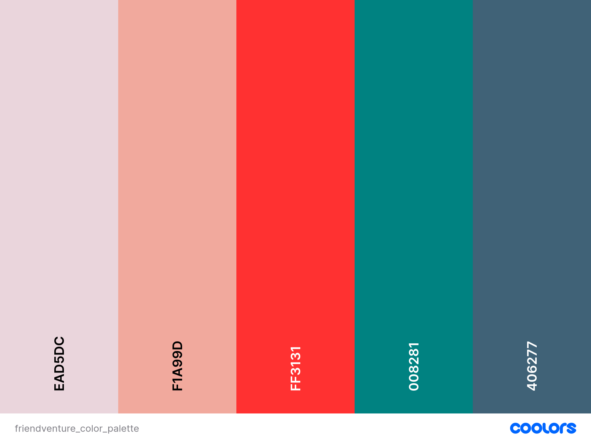
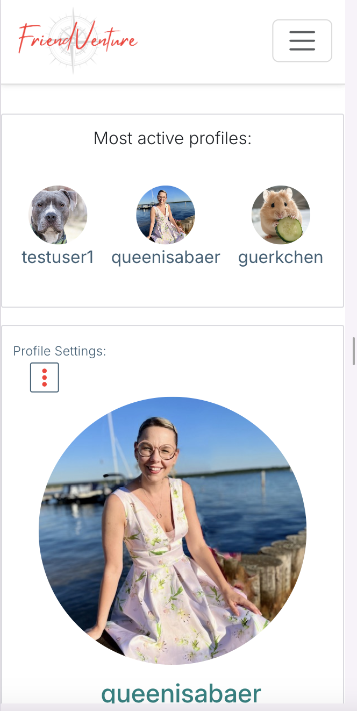
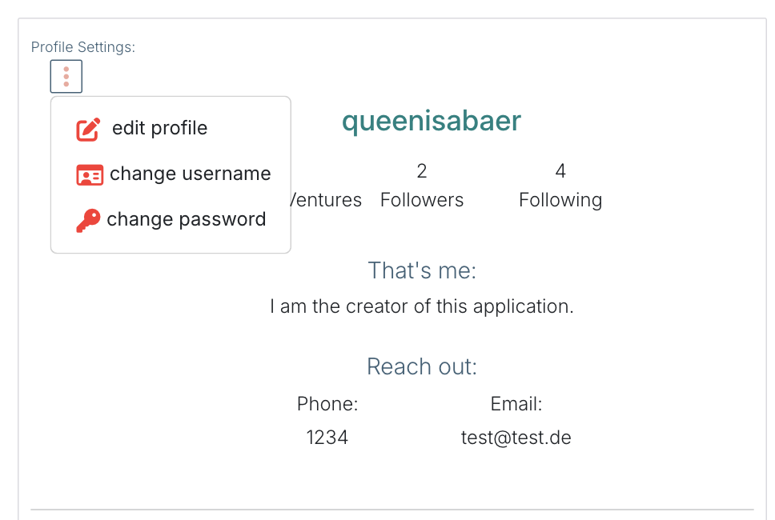
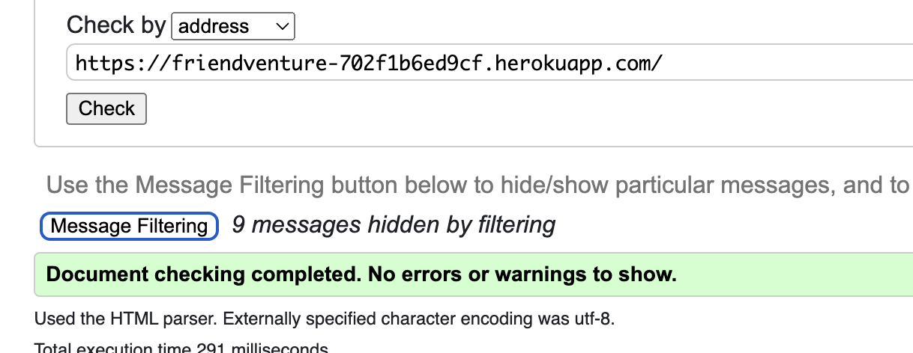

# FriendVenture

**Advanced Front-End Portfolio Project(PP5) - Code Institute**

View the deployed site [here.](https://friendventure-702f1b6ed9cf.herokuapp.com/) 

The idea for this network has been with me for many years. A friend went through a tough breakup and, at the time, she and her former partner were very engaged in activities like canoeing and climbing. With her partner gone, she found it challenging to participate in these activities, as she missed having someone to join her without any romantic expectations—essentially, she wanted a “not a date” option. Given the scope of the platform was too broad for the project's limited timeframe, I decided to pursue a streamlined version. FriendVenture is designed as a platform for friends to organize and participate in events, known as FriendVentures, without the pressure of romantic connotations.

The FriendVenture frontend is the user interface component of the FriendVenture application, designed with React to provide an engaging and intuitive experience for users interacting with the social network. It connects with the [FriendVenture API](https://friendventure-api-8b417af3d1a0.herokuapp.com/), enhancing user experience by offering a responsive and dynamic interface.

 

## Table of contents

- [User Experience](#user-experience)
  - [Milestones](#milestones)
  - [Epics and User stories](#epics-and-user-stories)
- [Design](#design)
  - [Wireframes](#wireframes)
  - [Logo](#logo)
  - [Favicon](#favicon)
  - [Typography](#typography)
- [Structure](#structure)
- [Features](#features)
- [Bugs](#bugs)
- [Technologies Used](#technologies-used)
  - [Languages](#languages)
  - [Tools](#tools)
  - [Frameworks](#frameworks)
  - [Libraries and modules](#libraries-and-modules)
- [Testing](#testing)
  - [Validator Testing](#validator-testing)
  - [Lighthouse Test](#lighthouse-test)
  - [Manual testing](#manual-testing)
  - [Browser Compatibility](#browser-compatibility)
  - [Automated Testing](#automated-testing)
- [Deployment](#deployment)
  - [Heroku](#heroku)
  - [Local deployment](#local-deployment)
  - [Forking this GitHub repository](#forking-this-github-repository)
  - [Clone this repository](#clone-this-repository)
- [Credits](#credits)
  - [Content](#content)
  - [Code](#code)
  - [ReadMe](#readme)
  - [Acknowledgments](#acknowledgments)

## User Experience

I used an Agile methodology approach to plan this project. This was implemented through the GitHub Project board with milestones, epics, user stories and tasks. Given the limited time frame, I've prioritized creating a broad overview of the project's features through high-level user stories, epics, and milestones. In a collaborative environment, I would delve into more granular user stories to ensure a comprehensive understanding of the requirements.
Each user story was classified with a label according to MoSCoW prioritization. 
The Kanban board can be seen [here](https://github.com/users/queenisabaer/projects/4).

### Milestones

The project was divided into five milestones, each containing the corresponding epics and user stories: 
- [Basic Website Setup](https://github.com/queenisabaer/friendventure/milestone/1)
- [FriendVenture MVP - API](https://github.com/queenisabaer/friendventure/milestone/5)
- [FriendVenture MVP - User Authentication & Profile Management](https://github.com/queenisabaer/friendventure/milestone/2)
- [FriendVenture MVP - FriendVenture Feature](https://github.com/queenisabaer/friendventure/milestone/3)
- [Testing and Validation](https://github.com/queenisabaer/friendventure/milestone/4)

### Epics and User stories

*FriendVenture* is designed for active individuals who love to connect and explore new experiences with others. The platform offers a space for users to discover and participate in activities called FriendVentures. While it’s open to everyone, the primary focus is on those who enjoy staying active, socializing, and trying new things. FriendVenture helps users connect with like-minded people and enrich their social life. 

List of Epics:  
- [EPIC: Repository and agile tool](https://github.com/queenisabaer/friendventure/issues/1)
- [EPIC: API - Basic Profile & FriendVenture Management](https://github.com/queenisabaer/friendventure/issues/33)
- [EPIC: API - Social Interactions](https://github.com/queenisabaer/friendventure/issues/34)
- [EPIC: User Registration and Authentication](https://github.com/queenisabaer/friendventure/issues/5)
- [EPIC: Profile Management](https://github.com/queenisabaer/friendventure/issues/9)
- [EPIC: FriendVenture Creation](https://github.com/queenisabaer/friendventure/issues/13)
- [EPIC: Engage with a FriendVenture](https://github.com/queenisabaer/friendventure/issues/17)
- [EPIC: Testing](https://github.com/queenisabaer/friendventure/issues/23)
- [EPIC: Validation](https://github.com/queenisabaer/friendventure/issues/27)

User Stories with their id:   
- As a new user I want to register an account so that I can fully interact with the website. [#6](https://github.com/queenisabaer/friendventure/issues/6)
- As a user I can log in to the website so that I can use all the features of the website.[#7](https://github.com/queenisabaer/friendventure/issues/7)
- As a logged-in user I am able to log out so that I can keep my account secure. [#8](https://github.com/queenisabaer/friendventure/issues/8)
- As a logged-in user, I want to view my profile and the profiles of other users so that I can see profile information, their friendventures, and updates. [#10](https://github.com/queenisabaer/friendventure/issues/10)
- As a logged-in user I can follow or unfollow another user so that can see their updates and FriendVentures in my feed. [#12](https://github.com/queenisabaer/friendventure/issues/12)
- As a logged-in user I can create a new FriendVenture so that I can invite my friends to join the activity. [#14](https://github.com/queenisabaer/friendventure/issues/14)
- As a logged-in user I want to edit my existing FriendVenture so that I can update details if plans change. [#15](https://github.com/queenisabaer/friendventure/issues/15)
- As a logged-in user I can delete my existing FriendVenture so that I can remove it if the event is cancelled. [#16](https://github.com/queenisabaer/friendventure/issues/16)
- As a logged-in user I can comment on a FriendVenture so that I can share my thoughts or ask questions about the event. [#18](https://github.com/queenisabaer/friendventure/issues/18)
- As a logged-in user I can mark myself as participating in a FriendVenture so that others know I will be attending. [#20](https://github.com/queenisabaer/friendventure/issues/20)
- As a logged-in user I can bookmark a FriendVenture to remember so that I can easily find it later. [#21](https://github.com/queenisabaer/friendventure/issues/21)
- As a logged-in user I can like a comment on a FriendVenture so that I can show my appreciation for valuable comments. [#22](https://github.com/queenisabaer/friendventure/issues/22)
- As a logged-in user I can rate a FriendVenture so that I can show the creator of the event and other users how the event was. [#19](https://github.com/queenisabaer/friendventure/issues/19)

 

- As a superuser I can see a list of all profiles so that I can see all profiles that have been set up.[#32](https://github.com/queenisabaer/friendventure/issues/32)
- As a superuser I can see details of a profile so that I can see a person's profile data.[#32](https://github.com/queenisabaer/friendventure/issues/32)
- As a superuser I can see a list of all FriendVentures so that I can see all FriendVentures that have been set up. [#35](https://github.com/queenisabaer/friendventure/issues/35)
- As a superuser I can seethe details of a FriendVenture so that I can see all information about a specific FriendVentures. [#35](https://github.com/queenisabaer/friendventure/issues/35)
- As a superuser I can filter FriendVentures by category so that I can see only the FriendVentures associated with a specific category. [#35](https://github.com/queenisabaer/friendventure/issues/35)
- As a superuser I can see a list of all comments related to a FriendVenture so that I can see all comments that have been created for a friendventure by id. [#36](https://github.com/queenisabaer/friendventure/issues/36)
- As a superuser I can create a follow to another user so that I can follow other users. [#37](https://github.com/queenisabaer/friendventure/issues/37)
- As a superuser, I can view a list of all participants in a FriendVenture so that I can track who is joining each activity [#38](https://github.com/queenisabaer/friendventure/issues/38)
- As a superuser, I can view the participation details for a specific FriendVenture so that I can see which users are involved in that particular activity. [#38](https://github.com/queenisabaer/friendventure/issues/38)
- As a superuser, I can view all FriendVentures that users have added to their bookmarks lists so that I can see which activities users are interested in revisiting. [#39](https://github.com/queenisabaer/friendventure/issues/39)
- As a superuser, I can view details of specific FriendVentures in a user’s bookmarks list so that I can understand user interests and preferences. [#39](https://github.com/queenisabaer/friendventure/issues/39)

 

- As a developer, I require a repository on GitHub for the front-end part of the project so that I have full control over the project versions. [#2](https://github.com/queenisabaer/friendventure/issues/2)
- As a developer, I require a repository on Github for the api of the project so that I have full control over project versions [#3](https://github.com/queenisabaer/friendventure/issues/3)
- As a developer, I want to add a working kanban board to my repository so that I can track the tasks involved in creating the project.[4](https://github.com/queenisabaer/friendventure/issues/4)
- As a developer, I can automatically create a user profile when a new user signs up for my application so that the user has a profile ready for them upon registration.[#32](https://github.com/queenisabaer/friendventure/issues/32)
- As a developer, I want to implement python test procedures so that I can assess functionality, usability, responsiveness, and data management throughout the web application. [#24](https://github.com/queenisabaer/friendventure/issues/24)
- As a developer, I want to implement JavaScript test procedures so that I can assess functionality, usability, responsiveness, and data management throughout the web application. [#25](https://github.com/queenisabaer/friendventure/issues/25)
- As a developer, I want to implement manual test cases so that I can assess functionality, usability, responsiveness, and data management throughout the web application. [#26](https://github.com/queenisabaer/friendventure/issues/26)
- As a developer, I need to verify that my css files pass the W3C validation so that the code is executed correctly. [#29](https://github.com/queenisabaer/friendventure/issues/29)
- As a developer, I need to verify that my JavaScript files pass the jshint validation so that the code is executed correctly.[#30](https://github.com/queenisabaer/friendventure/issues/30)
- As a developer, I need to verify that my python files pass the pep8 validation so that the code is executed correctly. [#31](https://github.com/queenisabaer/friendventure/issues/31)
 

- As an admin, I want to access the site's administrative features so that I have access to the admin panel. [#8](https://github.com/queenisabaer/wishlist/issues/8)

## Design

### Wireframes
Due to lack of time, some of the originally planned features that can be seen on the wireframe had to be deleted or implemented differently. A detailed description of the existing features can be found [here](#features), how the implemented features differ from the wireframes can be found in every wireframe section. 

 Home page 

 
The original wireframes were created at the beginning of the project. The start home page was divided into versions for logged-out users and those who are logged in. During the project development, I did not have enough time to create the home page for logged-out users and the corresponding functionality. Therefore, this is a feature I would like to implement in the future. The wireframes also show a component that displays upcoming FriendVentures. This was also something that was discarded due to time constraints. Instead, the most active profiles are shown. Additionally, the category filtering option has not yet been implemented. 
  

Wireframe for home page for logged-out user:  
 
Wireframes for home page for logged-in user:
 
 

 Sign up & Log In 

 
User authentication was implemented using dj-rest-auth. This library provides a comprehensive set of features for user management, including registration, login, and logout functionalities.
For the final design of the authentication views, I utilized the Code Institute moments walkthrough design, which closely aligns with the wireframes originally created for the project. This approach ensured a consistent user experience throughout the application. 

 
 

 Create a FriendVenture 

 
To create a FriendVenture, a form was designed that closely resembles the one outlined in the wireframes. This form includes fields for all necessary information, ensuring a seamless user experience that aligns with the original design specifications. 

 
 

 Profile Page 

 
The profile page differs in some respects from the final version. One notable feature is the component that displays upcoming FriendVentures, which is a feature I plan to implement in the future. Additionally, the page was intended to include further filtering of FriendVentures, showing those that have already taken place and in which the user participated. This functionality was discarded during the course of the project. 

 
 

### Imagery
 
The friendly ghost, which can be seen in the placeholder images or in the not found sections, was found at Pixabay. It was created by [madebytin](https://pixabay.com/de/illustrations/geist-boo-halloween-niedlich-8250317/). The pink of the cheeks was also integrated into the color palette.

The logo, the not found image, the 404 image, the placeholder images of the users' profile and of the FriendVentures were designed by me with [Canva](https://www.canva.com/).

#### Logo

 The FriendVenture logo features a light grey compass as the central symbol, with the brand name "FriendVenture" written above it in a handwritten red font. The choice of a compass represents exploration, guidance, and the spirit of adventure, perfectly aligning with the theme of discovering new experiences and journeys with friends. 

   

#### Favicon

The favicon was created with [Favicon.io](https://favicon.io/favicon-generator/) by using the logo in a square form. 

  

#### Colour Scheme:
  
The color palette was created based on the red color of the logo text with [ColorSpace](https://mycolor.space/?hex=%23FF3131&sub=1). Additionally, the pink from the cheeks of the little ghost, which always serves as a placeholder, was used.

 Click here to see the colour palette 

 

I created this colour palette with [coloors](https://coolors.co/). 
 

### Typography

[Shadows Into Light](https://fonts.google.com/specimen/Shadows+Into+Light) was used as font for headings. This font is similar to the one used in the logo. Since the logo was designed with Canva and the font used was not freely available, I searched for a similar-looking alternative. 
[Inter](https://fonts.google.com/specimen/Inter) was selected for text content. It is a clean font that goes really well with the heading font.  Both fonts were imported via Google Fonts. 

## Structure 

All information about the structure can be found in the README of the API [here](https://github.com/queenisabaer/friendventure-api)

## Features

### Existing Features

To learn more about each feature, please click on the respective headline

 Header with logo and navbar 

 

To ensure uniformity and a sense of familiarity for users, all pages include the same header with navigation links depending on the authentication status of the user. 
The header consists of the logo, which is always arranged on the left and acts as a link to return to the main page. On the right side is the navigation bar, which turns into a clickable burger menu on smaller screens. Depending on whether the user is logged in or not, the navigation elements adapt accordingly. 
A particular challenge was implementing the dropdown menu within the navigation bar on smaller screens (as a burger menu) when the user is logged in. The dropdown menu needed to remain accessible even when the main dropdown item (FriendVentures) was clicked in the burger menu. In other cases, the burger menu should naturally close as soon as a link is clicked to ensure a better user experience. However, for the dropdown menu, it should first open when the dropdown item is selected, and only after a link within this menu is clicked should the burger menu close again. 
The navigation menu also closes in mobile view when a click occurs outside of it. 
 

View for users who are not logged in: 
  - Screenshot of header in mobile view: 
   
  - Screenshot of header in mobile view with toggled navigation: 
   
  - Screenshot of header on larger screens: 
   

  
  View for users who are logged in: 
  - Screenshot of header in mobile view: 
   
  - Screenshot of header in mobile view with toggled navigation: 
   
  - Screenshot of header in mobile view with dropdown in toggled navigation: 
   
  - Screenshot of header in desktop view: 
   
  - Screenshot of header in desktop view with dropdown: 
   

 Favicon & Title

 

To create a consistent appearance, the logo, which appears in a rectangular form in the navigation bar, was adapted into a square version to create the favicon. A fitting title was also added to maintain consistency in the overall design. 
Screenshot of the favicon: 
 

 User authentication 

 

The user authentication system is implemented using the [dj-rest-auth](https://dj-rest-auth.readthedocs.io/en/latest/) framework, ensuring secure and reliable access to the site. This feature includes standard registration, login, and logout processes, with error handling and feedback tailored to match the application's design.  

**Sign Up** 
Users who are new to the site or have not yet created an account, can select the "Sign up" option from the Navigation Bar to register for a new user account. This process utilizes the standard dj-rest/auth/registration method for user account creation. Error messages for the username and password fields have been customized to match the application's color scheme. After properly registering, the user will be redirected to the login page and a success message will be displayed for two seconds. 
Screenshot for Sign Up:  
 
Screenshot for Sign Up with Error message for username:  
 
Screenshot for Sign Up with Error message for password:  
 
Screenshot of success message after properly registration:  
 

**Log in**  
Users who already have an account can click on the "Login" option in the Navigation Bar to access their account. This page utilizes the standard dj-rest/auth/login method for user authentication. Error messages for the username and password fields have been customized to match the application's color scheme. After the user correctly logs in, a success message is displayed for 2 seconds, and the user is redirected to the homepage, where an overview of all created FriendVentures is shown. 
Screenshot for Log In:  
 
Screenshot for Log In with error message:  
 
Screenshot of success message after properly log-in:  
 

**Log Out** 
To log out, the user simply needs to click on the "Log Out" option in the menu. Upon doing so, the user is successfully logged out via the /dj-rest-auth/logout/ endpoint, is redirected to the log-in page, and a success message is displayed. 
Screenshot for Log out success message  
 

 User Profile 

 

The user can access their profile only if logged-in through the navigation bar, from the "Most Active Profiles" section (if they are listed there), the participants or comments section by clicking on their username or profile picture.  

The profile contains the following components: 
**Profile Picture**: If the user hasn’t uploaded a picture, a placeholder image featuring the cute ghost that appears throughout the site is shown. 
**Username**: The username that the user created during the signup process. 
**Follow/Unfollow button**: This button appears only if the user being viewed is not the currently logged-in user. 
**Overview of FriendVentures**: Displays the number of FriendVentures the user has currently created. 
**Followers and Following Counts**: Shows how many people are following the user and how many people the user is following. 
**"That's Me" Description**: A personal description if the user has filled it out. 
**Contact Information (Reach out)**: A section where the user can provide their phone number and email address. If these are not provided, a placeholder text is displayed. 
When a user creates a FriendVenture, the FriendVenture count on their profile increases. If the user follows or unfollows another user, the followers count on their profile will increase or decrease accordingly. Similarly, if another user follows or unfollows them, the following count will be updated. Additionally, the follow/unfollow button will change to reflect the current following status.
Below these components, there is an overview of all the FriendVentures the user currently has online.If the user has created more than 10 FriendVentures, additional FriendVentures will continue to load as the user scrolls down (infinite scroll functionality). During this process, a spinner is briefly displayed to indicate that more content is being loaded. 
When a user visits their own profile, three dots outlined in green appear on the right side. Clicking on these dots reveals a dropdown menu where the user can edit their profile, username, or password. Each option redirects the user to the corresponding form page for making the desired changes.  
When editing their profile, the user must ensure that the profile picture does not exceed 2 MB in size. Additionally, the phone number field must contain numerical values, and the email field must have a valid email address. 
 

Screenshot of profile page(desktop view) after signing up: 
 
Screenshot of profile page(mobile): 
 
Screenshot of profile page(desktop): 
 

**Edit a profile** 
Screenshot of profile page with edit menu(desktop): 
 
Screenshot of profile page with edit menu(mobile): 
 
Screenshot to edit the profile page and success message after editing: :
 
 
Screenshot of error messages: :
 
 
 

**Edit username**  
Screenshot of edit username page: 
 

**Edit password** 
Screenshot of edit password page: 
 

 FriendVenture Management

 
FriendVenture Management includes the following topics: 

**Adding a new FriendVenture**: Users can create and submit new FriendVentures through a designated form.
**FriendVenture Detail View**: Users can view detailed information about a specific FriendVenture by clicking on the title or the image in the friendventure card. 
**Editing or deleting an existing FriendVenture**: Users can modify or remove their existing FriendVentures through an edit or delete option.
**Overview of all existing FriendVentures on Homepage**: The home page displays a comprehensive list of all available FriendVentures.
**Overview of FriendVentures created by the user on their profile page**: Users can view a summary of all FriendVentures they have created from their profile page.
**Overview of bookmarked FriendVentures**: Users can access a list of FriendVentures they have bookmarked for quick reference.
**Overview of upcoming FriendVentures as a Participant**: Users can view a list of upcoming FriendVentures they are participating in.   

 - **Adding a new FriendVenture** 
To add a FriendVenture, the user must sign up and log in. They can then navigate to the appropriate page via the navigation bar. All form fields are required except for the description. The date must be today or in the future. The user can upload an image for the FriendVenture. If no image is uploaded, a placeholder image will be shown instead.
If a required field is not filled out, an error message will be shown indicating which fields need to be completed. 
After the user clicks the 'Create' button and all required fields are correctly filled, they will be redirected to the detail page of this FriendVenture, and a success message will be displayed. The creator of a FriendVenture is automatically added as a participant in the FriendVenture, indicated by a small checkmark on the person icon. 
 

Screenshot of 'add a FriendVenture' page: 
 
Screenshot of success message and participant icon: 
 
Screenshot of error message for image larger than 2 MB: 
 
Screenshot of error message for date validation: 
 

- **FriendVenture detail view** 
A FriendVenture contains several elements in its detailed view. The following elements are included for the owner of the FriendVenture: 
- **Title**: The title of the FriendVenture.  
- **Creator Information**: Displays the username of the creator with a link to their profile.  
- **Image**: The image associated with the FriendVenture or the placeholder image  
- **Description**: A brief description of the FriendVenture, if given by the user.  
- **Date, Time, and Location**: Details about when and where the FriendVenture will take place. 
- **Category**: Button styled representing categories for future feature use,(allowing FriendVentures to be filtered by category.) 
- **Last Updated**: Information on when the FriendVenture was last updated.  
Below these elements, there are three icons in a row with numbers next to each for counting:  
- **User Icon**: Displays the number of participants. If the currently logged-in user is a participant in the FriendVenture, the icon will have a small checkmark. 
- **Heart Icon**: Displays the number of bookmarks. If the currently logged-in user has bookmarked the FriendVenture, the heart will be filled with red. 
- **Comment Icon**: Shows the number of comments associated with the FriendVenture. 
Underneath these icons is the comments section. 
**Participants List:**
In mobile view, the list of participants is displayed underneath the comments section.
In desktop view, the participants list appears next to the FriendVenture.
If the currently logged-in user is the owner of the FriendVenture, three dots will appear next to the creator information, indicating options to edit or delete the FriendVenture.  
 

Screenshot of FriendVenture detail page for owner of the FriendVenture in mobile view: 
 
Screenshot of FriendVenture detail page for other users of the FriendVenture in mobile view: 
 
Screenshot of FriendVenture detail page for owner of the FriendVenture in desktop view: 
 
Screenshot of FriendVenture detail page edit menu: 
 
 

- **Edit a FriendVenture** 
As part of the full CRUD functionality, the FriendVenture owner has the ability to edit the FriendVenture. When a user clicks the link to edit their FriendVenture, they are redirected to a form page where the existing data is already populated in the corresponding fields. The form retains the same validations as the "Create a FriendVenture" form, including image size limits (maximum 2 MB), required fields, and date validation (the date must be today or in the future). After the user clicks the "Update" button, they are redirected to the FriendVenture's detail page, and a success message is displayed confirming the update. 

Screenshot of edit page 
 
Screenshot of message: 
 

- **Delete a FriendVenture** 
As part of the full CRUD functionality, the FriendVenture owner can delete a FriendVenture. This can be achieved from the FriendVenture overview by clicking on the three dots as well as from the detail page of the FriendVenture. The user must confirm that he actually wants to delete the FriendVenture in a modal. After successful deletion, the user is redirected back to the homepage and the corresponding FriendVenture is deleted from the database and the overview. 

Screenshot of delete confirmation modal 
 

- **Displaying an overview of all existing FriendVentures on the Homepage.** 
The user can access the overview page of all FriendVentures that have been created by clicking on the homepage The user can access the overview page displaying all created FriendVentures by clicking on the "Home" link in the navigation bar or by clicking on the logo. This page presents FriendVentures sorted by the date they were added, with the most recent ones appearing first. Each FriendVenture is displayed in a card format that includes essential details such as the title, description, date, time, location, category, creator information (with a link to the creator's profile), and counts of participants, bookmarks, and comments. Additionally, the last updated timestamp is shown. Furthermore, if a FriendVenture's date and time are in the past, it will automatically be deleted from the FriendVenture overview pages. The overview page features infinite scroll functionality: when the user scrolls through 10 FriendVentures, the next set of FriendVentures is automatically loaded. During this process, a spinner is briefly displayed to indicate that more content is being loaded. 
In mobile view, the most active profiles are displayed above the FriendVentures, while in desktop view, they are displayed alongside the FriendVentures.
  

Screenshot of FriendVenture overview page  
 

- **Displaying an overview of bookmarked FriendVentures** 
When a user bookmarks a FriendVenture by clicking on the heart icon within the FriendVenture card, they can later access an overview page of all their bookmarked FriendVentures. This page can be reached through the navigation bar by selecting  *Bookmarks* in the FriendVentures dropdown menu. The bookmarked FriendVentures are displayed similarly to those on the homepage overview, with each FriendVenture presented in a card format. This includes the title, description, date, time, location, category, creator information (with a link to the creator's profile), and counts of participants, bookmarks, and comments, as well as the last updated timestamp. The page also features infinite scroll functionality, where additional FriendVentures are loaded after scrolling through the first 10 entries, with a brief display of a spinner indicating the loading process. In mobile view, the most active profiles are displayed above the FriendVentures, while in desktop view, they are displayed alongside the FriendVentures.  

- **Displaying an overview of upcoming FriendVentures(as Participant)** 
When a user marks themselves as a participant in a FriendVenture by clicking on the person icon within the FriendVenture card, they can later access an overview page of all FriendVentures they are participating in. This page can be accessed through the navigation bar by selecting *Upcoming* in the FriendVentures dropdown menu. The participating FriendVentures are displayed similarly to those on the homepage overview, with each FriendVenture presented in a card format. This includes the title, description, date, time, location, category, creator information (with a link to the creator's profile), and counts of participants, bookmarks, and comments, as well as the last updated timestamp. The page also features infinite scroll functionality, where additional FriendVentures are loaded after scrolling through the first 10 entries, with a brief display of a spinner indicating the loading process. In mobile view, the most active profiles are displayed above the FriendVentures, while in desktop view, they are displayed alongside the FriendVentures.

- **Displaying an overview of all FriendVentures created by user** 
As already explained in the profile feature, all FriendVentures created by the user are listed on their profile

 User Interaction 

 
Users can interact with each other in the following ways:
- Commenting on a FriendVenture by going to the detailed view of the FriendVenture, which can also be accessed by clicking on the comment icon.
- Marking themselves as a participant to join the event by clicking on the person icon.
- Bookmarking a FriendVenture by clicking on the heart icon.
- Follow/Unfollow functionality by clicking on the Follow/Unfollow button, which is available in the "Most Active Users" section, the participants list, and the profile overview. This option is only available when the logged-in user is not viewing their own profile.  

**Participation and Bookmark Icons**:  
The icons representing participation (person icon) and bookmarks (heart icon) dynamically change based on the user's status: 
- *Participation*: When the user clicks on the person icon, it toggles their participation status. If the user is now a participant, the icon will display a small checkmark, and the participant count will increase accordingly. 
- *Bookmarks*: When the user clicks on the heart icon, it toggles the bookmark status of the FriendVenture. If the user has bookmarked the FriendVenture, the heart icon will turn red, and the bookmark count will increase accordingly. 

**Comment Section:**
Users can interact with the FriendVenture by adding comments:  

The user's profile image is displayed next to the comment form field. After entering a comment and clicking the "add comment" button, the comment is displayed under the FriendVenture in a list format. Each comment includes the commenter's profile image, username, the time when the comment was added, and the comment content.
If the currently logged-in user is the owner of the comment, three dots appear next to the comment, providing options to edit or delete the comment.  
- *Edit*: When the user clicks "Edit" on their comment, the comment form reopens with the existing content. The user can then update the comment and save the changes. Alternatively, they can cancel the edit, which will close the form, leaving the comment unchanged.  
- *Delete*: When the user clicks "Delete" on their comment, a confirmation modal appears. Upon confirming the deletion, the comment is removed from the list.

 
 
 
Icons where the user is also a participant, FriendVenture has a bookmark and FriendVenture contains 4 comments:  
 
Icons where the user is not a participant, FriendVenture has no bookmark and the FriendVenture contains 0 comments: 
 

 404 - Not Found page 

 

A dedicated 404 error page has been created to handle instances where users navigate to a non-existent page. The page features a placeholder image of a ghost holding a sign with the number "404" to indicate that the requested page could not be found. Clicking on the ghost image redirects users back to the home page. Below the image, there is a short message: "Boo! Looks like you’re lost! Come back to the homepage". This message is also a clickable link that redirects users to the home page. 

 

 

 Redirect functionality for the user depending on loggedin or loggedout status 

 
The application includes a redirect functionality to manage user access based on their logged-in or logged-out status. If the user is logged in, they cannot access the Signup or Login pages, even by typing the URL directly in the browser; any attempt to do so will automatically redirect them to the homepage. Conversely, if the user is logged out, they are restricted from accessing the user profile page, the detail page of a FriendVenture, or interacting with FriendVentures (such as bookmarking, commenting, or participating). In such cases, the user is always redirected to the homepage.
 

### Features, which I would like to implement in the future

- *Delete a Profile*: Allow users to permanently delete their profiles from the platform. This feature will include necessary confirmations and safeguards to prevent accidental deletions. 
- *Filter FriendVentures by category*: Enable filtering of FriendVentures based on categories. This will help users find events that match their interests more easily. 
- *Upcoming FriendVenture component on profile page*: Add a component to the user profile page that displays upcoming FriendVentures, as illustrated in the wireframes. This component will provide a quick view of future activities associated with the user.
- *Use of DateTime for upcoming events component*: Implement DateTime functionalities for the upcoming events component. This will allow for more precise scheduling and display of events, improving user experience by accurately reflecting event times.
- *Optimize CurrentUserContext for participants*: Enhance the CurrentUserContext to streamline the process of displaying participants' avatars. This optimization will avoid unnecessary filtering of all profiles and ensure avatars are still shown correctly.
- *Add post-event categories and comment enhancements*: Allow FriendVentures that have taken place to be moved into a different category for participants. Additionally, enable users to add pictures to their comments and provide the option to rate the FriendVenture.
- *Star review for FriendVentures*: Implement a feature to display star ratings for FriendVentures. Users will be able to see how their FriendVentures have been rated by others, providing feedback and improving event quality.
- *Creating a special start page for logged out user*: Develop a unique start page for users who are not logged in to provide a more engaging and informative experience tailored to their status. (as can be seen in the original wireframes)

## Bugs NEEDS UPDATE

 ESLint Configuration 

 
The configuration of ESLint turned out to be more difficult because I set up the React project with the latest version using Vite. For example, importing React at the top of the JSX files is no longer necessary. After I properly configured ESLint for the development phase without constant warnings and errors being displayed, I had to set it up again for the final testing. For this, I followed the approach published in the following thread. After that, the test ran without any errors or warnings. 
 

 
 
 

 time 

 
time (was undefinied, had to update friendventure.jsx)
 

 
 

 currentUser tokens 

 
xxx 

 
 

 Upating an image 

 
update image wasn't working. got an cors property error. forget trailing slash
 

 
 

## Technologies Used NEEDS UPDATE

### Languages:
- [CSS](https://en.wikipedia.org/wiki/CSS)
- [JavaScript](https://www.javascript.com/)
- [JSX](https://de.legacy.reactjs.org/docs/introducing-jsx.html)

### Tools:
- [Git](https://git-scm.com/) was used for version control by utilizing the Gitpod terminal to commit to Git and Push to GitHub.
- [GitHub](https://github.com/) was used to save and store the files for the website.
- [Heroku](https://www.heroku.com) was used to deploy the application.
- [CodeInstitute IDE - Gitpod](https://codeinstitute-ide.net/) was used as IDE. 
- [Code Insitute Database Maker](https://dbs.ci-dbs.net/) PostgreSQL database hosting for this project
- [Fontawesome](https://fontawesome.com/) was used to add icons to the website.
- [Balsamiq](https://balsamiq.com/) was used to create the wireframes.
- [Black Formatter](https://marketplace.visualstudio.com/items?itemName=ms-python.black-formatter) to beautify the code
- [LanguageTool](https://languagetool.org/) was used to check the grammar and spelling in the README and the Code. 
- [reverso](https://www.reverso.net/) was used to translate text from german to english.
- [Coloors](https://coolors.co/image-picker) was used to create the colour scheme.
- [Pixelied](https://pixelied.com/convert/jpg-converter/jpg-to-webp) was used to convert jpg images into wepb images.
- [Pixabay](https://www.pixabay.com/de-de/) was used to search and load images
- [Browserling](https://www.browserling.com/) was used to test the application on different browsers.
- [Cloudinary](https://cloudinary.com/) was used to store the images for friendVentures, and profiles.
- [Canva](https://www.canva.com/) was used to create the logo, and the placeholder images.
- [Favicon.io](https://favicon.io/favicon-generator/) was used to create the favicon.
- [Google Chrome Dev Tools](https://developer.chrome.com/docs/devtools?hl=de) were used to check the application for responsiveness and errors. 

### Frameworks: 
- [React](https://react.dev/) was initialized with [vite](https://vitejs.dev)/
- [React Bootstrap](https://react-bootstrap.netlify.app/)
- [React Router Dom](https://reactrouter.com/en/main)

### Libraries and modules:
- [Axios](https://axios-http.com/docs/intro)
- [React Infinite Scroll Component](https://www.npmjs.com/package/react-infinite-scroll-component)
- [Moment](https://momentjs.com/)

## Testing

The app was tested regularly and deployed early to Heroku to make sure both local and remote worked the same.

### Validator Testing

 HTML Validation

 

I passed my deployed html files through the [HTML Validator](https://validator.w3.org/nu/) and no errors were found. 
     

  

 CSS Validation

 

I passed m deployed css file through the [CSS Validator](https://jigsaw.w3.org/css-validator/) and no errors were found. 
     

  

 JavaScript Validation - ESLint

 

To validate the Javascript code in my code editor I used [ESLint](https://eslint.org/). Several minor issues were immediately corrected and no errors or warnings were shown. 
 
  

### Lighthouse Test

### Manual Testing

 Click here to see the testing table for features

 

| **Test** | **Test Description** | **Expected Outcome** | **Result** | 
|:---|:---|:---|:---|
| Header - Logo | Click on the logo to return to main page | Clicking on the logo on each page will return you to the main page | Pass |
| Header - Navbar toggle in tablet/mobile view | Click in tablet/mobile view on the burger icon to open the navigation | When the burger icon in mobile or tablet view is clicked, the navigation should open | Pass |
| Header - Close Navbar toggle in tablet/mobile view | Click outside of the toggeld navbar in tablet/mobile view | When clicking outside of the toggled navbar, the navbar should dissapear and the burger icon should be shown | Pass |
| Header - Navbar toggle inside the menu in tablet/mobile view | Click in tablet/mobile view on the burger icon to open the navigation and then click on FriendVentures | When the user clicks FriendVentures in mobile or tablet view, the dropdown should open | Pass |
| Header - Navigation link | Click on a term in the navigation bar to go to the corresponding page | Clicking on a page at the navigation bar should take the user to the corresponding page | Pass |
| Header - Navigation link (mobile view) | Click in the mobile view on a term in the navigation bar to go to the corresponding page and close the toggled burger menu | Clicking on a page at the navigation bar should take the user to the corresponding page and close the toggled burger menu | Pass |
| Header - Navigation links and items | Depending on whether the user is logged in or not, the navigation elements should adapt accordingly | After logging in, the navigation menu should adjust accordingly. | Pass |
| Favicon & Title | When opening the page or navigating within it, the favicon and the title should be visible. | After opening the page or navigating within it, tha favicon should be visible. | Pass |
| Sign Up | Fill out each field and click on the sign-me-up button. | After filling out every form field with validate input, and clicking the 'Sign Up' button, the user should be redirected to the verify email page and receive an email to verify the mail address | Pass |
| Sign Up - error message | Fill the username field with a username that is already existing or a pwassord that didn't match, and click on the sign-me-up button. | After entering a username that already exists or a password that doesn't match, and clicking the "sign me up" button, an error message should be displayed. | Pass |
| Log In | Log in with username and password | Clicking on the 'Log In' button after providing the correct username and password, the user should be redirected to the main page, and the navigation menu should change. In addition, a message that a successful login has taken place should be displayed. | Pass |
| Log out | Click 'Log out' in the navigation bar | After clicking on Log out, the user is logged out, redirected to the log in page, the navigation bar for logged out users is shown, and a message is displayed. | Pass |
| Redirect Logged In - Signup/Login | Manually enter the URL for the Signup or Login page in the browser while logged in. | The user is redirected to the homepage, and the Signup/Login page is not accessible. | Pass |
| Redirect Logged out - Profile Page | Manually enter the URL for the user profile page in the browser while logged out. | The user is redirected to the homepage, and the profile page is not accessible. | Pass |
| Redirect Logged out - FriendVenture Detail Page | Manually enter the URL for a FriendVenture detail page in the browser while logged out. | The user is redirected to the homepage, and the FriendVenture detail page is not accessible. | Pass |
| Redirect Logged out - FriendVenture Interaction | Attempt to bookmark, comment, or participate in a FriendVenture while logged out. | The user is redirected to the homepage, and the interaction is not allowed. | Pass |
| User Profile Access - Logged In | Access the profile page via the navigation bar, "Most Active Profiles" section, participants section, or comments section by clicking on the username or profile picture. | The user should be able to access their profile page. | Pass |
| Profile Picture Display | Access the profile page where the user has not uploaded a picture. | A placeholder image featuring the cute ghost should be displayed. | Pass |
| Username Display | Access the profile page. | The username displayed should be the one created during the signup process. | Pass |
| Follow/Unfollow Button Visibility | Access the profile page of a user who is not the currently logged-in user. | The follow/unfollow button should be visible. Access the profile page of the logged-in user. | The follow/unfollow button should not be visible. | Pass |
| Profile page - overview of FriendVentures | Access the profile page. | The number of FriendVentures the user has created should be displayed accurately. | Pass |
| Followers and Following Counts | Access the profile page. | The number of followers and the number of people the user is following should be displayed accurately. | Pass |
| "That's Me" Description | Access the profile page where the user has provided a description. | The description should be displayed if it is filled out. If not, the field should be show placeholder text. | Pass |
| Contact Information (Reach Out) | Access the profile page. | Phone number and email address fields should display the user's information if provided. If not provided, placeholder text should be displayed. | Pass |
| Infinite Scroll for FriendVentures | Access a profile page with more than 10 FriendVentures and scroll down. | Additional FriendVentures should load as the user scrolls, and a spinner should be briefly displayed during loading. | Pass |
| Edit Profile Button - Own Profile | Visit own profile page. | Three dots outlined in green should appear on the right side. Clicking these dots should reveal a dropdown menu with options to edit profile, username, or password. | Pass |
| Redirect to Edit Profile Page | Click on 'Edit Profile' from the dropdown menu. | The user should be redirected to the edit profile page with existing data pre-filled in the form. | Pass |
| Confirm Profile Changes | On the edit profile page, click 'Confirm Changes'. | The user should be redirected back to the profile overview page, and a success message should be displayed for 3 seconds. | Pass |
| Profile Picture Size Validation | On the edit profile page, upload an image larger than 2 MB. | The system should reject the upload with an appropriate error message. | Pass |
| Phone Number Field Validation | On the edit profile page, enter non-numeric characters in the phone number field. | The system should reject the input with an appropriate error message. | Pass |
| Email Field Validation | On the edit profile page, enter an invalid email address. | The system should reject the input with an appropriate error message. | Pass |
| Profile Editing - Success Message and Redirect | Save all changes to the profile, and click the save button. | A success message should be displayed, and the user should be redirected to the profile page. | Pass |
| Add a new FriendVenture Page - Log In Required | Click on the navigation bar link 'Add' inside the dropdown menu *FriendVentures* to go to the 'Create a new FriendVenture' page. | After clicking the link, the user should be directed to the 'Create a new FriendVenture' page. | Pass |
| Required Fields - error message | On the 'Create a new FriendVenture' page, leave one or more required fields empty and attempt to submit the form. | An error message should be displayed indicating which required fields are missing. | Pass |
| Date field validation | On the 'Create a new FriendVenture' page, enter a date that is past the current date and try to submit the form. | The system should reject the date with an appropriate error message. | Pass |
| Image upload - less than 2 MB | On the 'Create a New FriendVenture' page, upload an image less than 2 MB and submit the form. | The uploaded image should be displayed as part of the FriendVenture. | Pass |
| Image Upload - more than 2 MB | On the 'Create a New FriendVenture' page, upload an image larger than 2 MB and try to submit the form. | An error message should be displayed indicating that the image size exceeds the limit. | Pass |
| Placeholder Image | On the 'Create a new FriendVenture' page, do not upload an image and submit the form. | A placeholder image should be shown in place of the uploaded image. | Pass |
| Successful creation - redirection and success message | Filling out all required fields correctly on the 'Create a New FriendVenture' page and click the 'Create' button. | The user should be redirected to the detail page of the friendVenture, and a success message should be displayed. | Pass |
| Automatic Participation | After creating a FriendVenture, check the list of participants for the created FriendVenture. | The creator of the FriendVenture should be automatically listed as a participant, indicated by a small checkmark on the person icon. | Pass |
| Edit FriendVenture -  Prevent unauthorized URL access for editing | Open the FriendVenture edit URL without logging in or as  a user who is a non-owner of the FriendVenture | Redirected to home page | Pass |
| FriendVenture detail view - title display | View the FriendVenture detail page | The title of the FriendVenture should be displayed correctly at the top of the detail page | Pass |
| FriendVenture detail view - creator information| View the FriendVenture detail page | The username of the creator should be displayed with a clickable link to their profile | Pass |
| FriendVenture detail view  - image display | View the FriendVenture detail page | The associated image or placeholder image should be displayed correctly | Pass |
| FriendVenture detail view - Description Display | View the FriendVenture detail page | The description should be displayed if provided, or no description section if not provided | Pass |
| FriendVenture detail view  - date, time, and location display | View the FriendVenture detail page | The correct date, time, and location of the FriendVenture should be displayed | Pass |
| FriendVenture detail view - category display | View the FriendVenture detail page | The category should be displayed correctly, styled like a button, for future filtering functionality | Pass |
| FriendVenture detail view - last updated information | View the FriendVenture detail page | The last updated date should be displayed correctly beneath the category button | Pass |
| FriendVenture detail view - user icon (participant count) | View the FriendVenture detail page as a logged-in user | The user icon should display the correct number of participants, with a checkmark if the user is a participant | Pass |
| FriendVenture detail view - heart icon (bookmark count) | View the FriendVenture detail page as a logged-in user | The heart icon should display the correct number of bookmarks, filled with red if the user has bookmarked the FriendVenture | Pass |
| FriendVenture detail view - comment icon (comment count) | View the FriendVenture detail page | The comment icon should display the correct number of comments associated with the FriendVenture | Pass |
| FriendVenture detail view - comments section display | View the FriendVenture detail page | The comments section should be displayed correctly below the icons | Pass |
| FriendVenture detail view - participants list (mobile view) | View the FriendVenture detail page on a mobile device | The participants list should be displayed underneath the comments section | Pass |
| friendVenture detail view - participants list (desktop view) | View the FriendVenture detail page on a desktop device | The participants list should be displayed next to the FriendVenture card | Pass |
| FriendVenture detail view - edit/delete options for owner | View the FriendVenture detail page as the owner | Three dots should appear next to the creator information, allowing the owner to edit or delete the FriendVenture | Pass |
| FriendVenture detail view - prevent unauthorized access to edit/delete | Attempt to access the edit/delete options without being logged in or as a non-owner of the FriendVenture | The options should not be available, and unauthorized users should be redirected to the homepage | Pass |
| FriendVenture edit - pre-filled form data | Click the edit link for a FriendVenture | The user should be redirected to a form page where all the existing FriendVenture data is pre-filled in the corresponding fields | Pass |
| FriendVenture edit - required fields validation | Attempt to submit the edit form without filling out the required fields | An error message should be displayed, indicating the missing required fields | Pass |
| FriendVenture edit - image size validation | Upload an image larger than 2 MB on the edit form and try to submit | An error message should be displayed, preventing the form submission due to the large image size | Pass |
| FriendVenture edit - date validation | Enter a date in the past on the edit form and try to submit | An error message should be displayed, preventing the form submission due to invalid date | Pass |
| FriendVenture edit - successful update and redirect | Submit the form with valid data by clicking the update button | The user should be redirected to the FriendVenture detail page, and a success message should be displayed | Pass |
| FriendVenture edit - prevent unauthorized URL access | Attempt to access the edit form URL without being logged in or as a non-owner of the FriendVenture | The user should be redirected to the home page, and the edit form should not be accessible | Pass |
| Delete FriendVenture - access from overview | On the FriendVenture overview page, click on the three dots next to a FriendVenture and select the delete option | A modal should appear asking for confirmation to delete the FriendVenture | Pass |
| Delete FriendVenture - access from detail page | On the FriendVenture detail page, click on the three dots next to the FriendVenture information and select the delete option | A modal should appear asking for confirmation to delete the FriendVenture | Pass |
| Delete FriendVenture - modal confirmation | In the deletion confirmation modal, click the confirm button to delete the FriendVenture | The FriendVenture should be deleted, the user should be redirected to the homepage, and the FriendVenture should no longer be visible in the overview | Pass |
| Delete FriendVenture - cancel deletion | In the deletion confirmation modal, click the cancel button | The modal should close, and no changes should be made; the FriendVenture should remain in the overview | Pass |
| Delete FriendVenture - prevent unauthorized deletion via URL | Attempt to access the FriendVenture deletion URL directly as a non-owner or without logging in | The user should be redirected to the homepage or an error page, and the FriendVenture should remain undeleted | Pass |
| Delete FriendVenture - database removal verification | After confirming the deletion of a FriendVenture, check the database to ensure the FriendVenture record is removed | The FriendVenture should no longer exist in the database | Pass |
| Delete FriendVenture - redirect after deletion | After successfully deleting a FriendVenture, verify that the user is redirected to the homepage | The user should be on the homepage, and the deleted FriendVenture should not be visible | Pass |
| FriendVenture - automatic deletion | As a logged-in user, create a FriendVenture with a date and time in the future and wait until scheduled date and time are in the past. | The FriendVenture should be automatically deleted from the overview pages. | Pass |
| FriendVenture - automatic deletion | Attempt to access the FriendVenture's detail page after the event's scheduled time has passed. | The page should no longer be accessible; a "404 Not Found" error or redirection to the homepage should occur. | Pass |
| Overview page - access via home link | Click on the "Home" link in the navigation bar | The user should be redirected to the overview page displaying all FriendVentures sorted by the date added | Pass |
| Overview Page - access via logo | Click on the logo in the header | The user should be redirected to the overview page displaying all FriendVentures sorted by the date added | Pass |
| FriendVenture card - display elements | Navigate to the overview, bookmarks, explore pages and view a FriendVenture card | Each FriendVenture card should display the title, description, date, time, location, category, creator information, participant count, bookmark count, comment count, and last updated timestamp | Pass |
| FriendVenture Card - creator link | Click on the creator's name in a FriendVenture card | The user should be redirected to the profile page of the creator | Pass |
| FriendVenture sorting - date added | Navigate to the overview page | FriendVentures should be sorted by the date they were added, with the most recent ones appearing first | Pass |
| Overview page (mobile view) - most active profiles lacement | Access the overview page on a mobile device | The most active profiles should be displayed above the FriendVentures | Pass |
| Overview page (desktop view) - most active profiles placement | Access the overview page on a desktop device | The most active profiles should be displayed next to the FriendVentures | Pass |
| Overview page infinite scroll - load more FriendVentures | Scroll down the overview page after 10 FriendVentures are loaded | The next set of FriendVentures should be automatically loaded, and a spinner should be displayed briefly while loading | Pass |
| Bookmark a FriendVenture - Heart Icon | Click the heart icon on a FriendVenture card on the homepage | The heart icon should turn red, indicating the FriendVenture is bookmarked, and the bookmark count should increase by 1 | Pass |
| Access bookmarked FriendVentures - navigation bar | Click on the dropdown FriendVentures *Bookmarks* in the navigation bar | The user should be redirected to the overview page displaying all bookmarked FriendVentures | Pass |
| Bookmarks page - display elements | Navigate to the bookmarked FriendVentures overview page | Each FriendVenture card should display the title, description, date, time, location, category, creator information, participant count, bookmark count, comment count, and last updated timestamp | Pass |
| Bookmarks page - creator link | Click on the creator's name in a FriendVenture card on the bookmarked FriendVentures page | The user should be redirected to the profile page of the creator | Pass |
| Bookmarks page infinite scroll (load more bookmarked FriendVentures) | Scroll down the bookmarked FriendVentures overview page after 10 FriendVentures are loaded | The next set of bookmarked FriendVentures should be automatically loaded, and a spinner should be briefly displayed while loading | Pass |
| Unbookmark a FriendVenture | Click the heart icon on a FriendVenture card that was bookmarked from the currently logged-in user | The heart icon should no longer be red, the FriendVenture should be removed from the bookmarked overview, and the bookmark count should decrease by 1 | Pass |
| Bookmarks page (mobile view) - most active profiles placement | Access the bookmarked FriendVentures overview page on a mobile device | The most active profiles should be displayed above the FriendVentures | Pass |
| Bookmarks page (desktop view) - most active profiles placement | Access the bookmarked FriendVentures overview page on a desktop device | The most active profiles should be displayed next to the FriendVentures | Pass |
| Mark as participant - person icon | Click the person icon on a FriendVenture card | The person icon should show a checkmark, indicating the user is a participant, and the participant count should increase by 1 | Pass |
| Access participating FriendVentures - navigation bar | Click on *Upcoming* in the dropdown menu *FriendVentures* in the navigation bar | The user should be redirected to the overview page displaying all FriendVentures they are participating in | Pass |
| Participating FriendVenture page - display elements | Navigate to the participating FriendVentures overview page | Each FriendVenture card should display the title, description, date, time, location, category, creator information, participant count, bookmark count, comment count, and last updated timestamp | Pass |
| Participating FriendVenture page - Creator Link | Click on the creator's name in a FriendVenture card on the participating FriendVentures page | The user should be redirected to the profile page of the creator | Pass |
| Participating FriendVenture page (infinite scroll)| Scroll down the participating FriendVentures overview page after 10 FriendVentures are loaded | The next set of participating FriendVentures should be automatically loaded, and a spinner should be briefly displayed while loading | Pass |
| Unmark as Participant | Click the person icon on a participating FriendVenture card | The checkmark on the person icon should disappear, the FriendVenture should be removed from the participating overview, and the participant count should decrease by 1 | Pass |
| Participating FriendVenture page (mobile view) - Most active profiles placement | Access the participating FriendVentures overview page on a mobile device | The most active profiles should be displayed above the FriendVentures | Pass |
| Participating FriendVenture page (desktop view) - Most Active Profiles Placement | Access the participating FriendVentures overview page on a desktop device | The most active profiles should be displayed next to the FriendVentures | Pass |
| Comment on a FriendVenture - log in required | Navigate to the detailed view of a FriendVenture and add a comment by typing in the comment section and clicking the "add comment" button. | The comment should be added, displayed in the comment section, and the comment count should increase by one. | Pass |
| Follow another User - log in required | Click on the Follow button in the "Most Active Users" section, participants list, or profile overview (when viewing another user’s profile). | The user should be marked as following, and the follower count on the followed user’s profile should increase by one. | Pass |
| Unfollow a User - log in required | Click on the Unfollow button in the "Most Active Users" section, participants list, or profile overview (when viewing another user’s profile). | The user should be marked as unfollowing, and the follower count on the unfollowed user’s profile should decrease by one. | Pass |
| Participation icon status - log in required | Click on the person icon in the FriendVenture card. | The icon should change to display a checkmark if the user is now a participant, and the participant count should increase accordingly. | Pass |
| Bookmark icon status - log in required | Click on the heart icon in the FriendVenture card. | The heart icon should turn red if the FriendVenture is now bookmarked, and the bookmark count should increase accordingly. | Pass |
| Comment section - profile image display | Navigate to the comment section of a FriendVenture. | The user's profile image should be displayed next to the comment form field and the comment, if the user added one. | Pass |
| Add comment - log in required | Enter a comment in the form field and click the "add comment" button. | The comment should be added, displayed under the FriendVenture, with the user's profile image, username, the time of the comment, and the comment content. The comment count should increase accordingly. | Pass |
| Edit comment - log in and owner-status required | Click the three dots next to the comment you own and select "Edit". | The comment form should reopen with the existing content. The user should be able to update the comment by clicking "Save" or cancel the edit by clicking "Cancel". The updated comment should be displayed if saved. | Pass |
| Delete comment - log in and owner-status required | Click the three dots next to the comment you own and select "Delete". Confirm the deletion in the modal. | The comment should be removed from the list, and the comment count should decrease accordingly. | Pass |
| 404 Error Page - image display and redirection | Navigate to a non-existent page to trigger the 404 error page | The error page should display the placeholder image of a ghost holding a "404" sign. Clicking the image should redirect the user to the home page. | Pass |
| 404 Error Page - error message display and redirection | Navigate to a non-existent page to trigger the 404 error page | The error page should display the message: "Boo! Looks like you’re lost! Come back to the homepage." Clicking the message should redirect the user to the home page. | Pass |
| 404 Error Page - error message link functionality | On the 404 error page, click on the message link: "Boo! Looks like you’re lost! Come back to the homepage." | The user should be redirected to the home page. | Pass |
| 404 Error Page - ghost image link functionality | On the 404 error page, click on the ghost image. | The user should be redirected to the home page. | Pass |
| Redirect - logged-in user tries to access signup page | As a logged-in user, try to access the Signup page by typing the URL directly in the browser. | The user should be automatically redirected to the homepage. | Pass |
| Redirect - logged-in user tries to access login page | As a logged-in user, try to access the Login page by typing the URL directly in the browser. | The user should be automatically redirected to the homepage. | Pass |
| Redirect - logged-out user tries to access profile page | As a logged-out user, try to access a user profile page by typing the URL directly in the browser. | The user should be automatically redirected to the homepage. | Pass |
| Redirect - logged-out user tries to access FriendVenture detail page | As a logged-out user, try to access the detail page of a FriendVenture by typing the URL directly in the browser. | The user should be automatically redirected to the homepage. | Pass |
| Redirect - logged-out user tries to bookmark a FriendVenture | As a logged-out user, attempt to bookmark a FriendVenture. | The user should be automatically redirected to the homepage. | Pass |
| Redirect - logged-out user tries commenting on a FriendVenture | As a logged-out user, attempt to comment on a FriendVenture. | The user should be automatically redirected to the homepage. | Pass |
| Redirect - logged-out user tries participating in a FriendVenture | As a logged-out user, attempt to mark participation in a FriendVenture. | The user should be automatically redirected to the homepage. | Pass |

 Click here to see the testing table for User Stories

 

| **User Story** | **Acceptance Criteria** | **Was achieved as follows** |
|:---|:---|:---|
| **User Story** | **Acceptance Criteria** | **Was achieved as follows** |
|:---|:---|:---|
| #6 As a new user I want to register an account so that I can fully interact with the website. | The registration page must include fields for necessary user information. Upon successful registration, the user should receive a confirmation message and be able to log in. | The registration page has fields for necessary information (username, password). Upon completion, the user receives a confirmation message and can log in. |
| #7 As a user I can log in to the website so that I can use all the features of the website. | The login page should have fields for username and password. Successful login should redirect the user to the home page with access to all features. | The login page includes fields for username and password. Successful login redirects the user to the home page with access to all features. |
| #8 As a logged-in user I am able to log out so that I can keep my account secure. | The user should have a visible 'Logout' option. After logging out, the user should be redirected to the login page, and the navigation should reflect the logged-out status. | The navigation bar includes a 'Logout' option. Logging out redirects the user to the login page, and the navigation bar updates to reflect the logged-out status. |
| #10 As a logged-in user, I want to view my profile and the profiles of other users so that I can see profile information, their FriendVentures, and updates. | The profile page should display the user’s information and FriendVentures. Viewing other users' profiles should show their details and FriendVentures. | The profile page displays the user's information, FriendVentures, and updates. Other users' profiles also show their details and FriendVentures. |
| #12 As a logged-in user I can follow or unfollow another user so that I can see their updates and FriendVentures in my feed. | The profile page should have 'Follow' and 'Unfollow' buttons that update based on the current following status. The feed should update to show the followed user's updates and FriendVentures. | 'Follow' and 'Unfollow' buttons are present and update based on the following status. The *explore* feed reflects updates and FriendVentures from followed users. |
| #14 As a logged-in user I can create a new FriendVenture so that I can invite my friends to join the activity. | The 'Create FriendVenture' page must have required fields and validation. After creating, the user should be redirected to the FriendVentures detail page with a success message. | The 'Create FriendVenture' page has required fields with validation. Successful creation redirects to the FriendVentures Detail page with a success message. |
| #15 As a logged-in user I want to edit my existing FriendVenture so that I can update details if plans change. | The 'Edit FriendVenture' page should pre-fill existing data. All fields should maintain the same validations. After updating, the user should be redirected to the FriendVenture detail page with a success message. | The 'Edit FriendVenture' page pre-fills existing data and maintains field validations. Successful update redirects to the detail page with a success message. |
| #16 As a logged-in user I can delete my existing FriendVenture so that I can remove it if the event is cancelled. | Deletion must be confirmed through a modal. After confirmation, the FriendVenture should be removed from the database and overview, and the user redirected to the home page. | Deletion is confirmed through a modal. After confirmation, the FriendVenture is removed from the database and overview, and the user is redirected to the home page. |
| #18 As a logged-in user I can comment on a FriendVenture so that I can share my thoughts or ask questions about the event. | The FriendVenture detail page should include a comment section where users can add comments. Comments should display with the commenter’s profile image and username. | The FriendVenture detail page includes a comment section where users can add comments. Comments are displayed with profile image and username. |
| #20 As a logged-in user I can mark myself as participating in a FriendVenture so that others know I will be attending. | The FriendVenture detail page should have a 'Participate' button that updates the participation status. The number of participants should be updated accordingly. | The FriendVenture detail page includes a 'Participate' icon. Clicking it updates the participation status and the number of participants. |
| #21 As a logged-in user I can bookmark a FriendVenture to remember so that I can easily find it later. | The FriendVenture detail page should include a 'Bookmark' icon. The icon should reflect the bookmark status, and bookmarked FriendVentures should be accessible from the bookmarks overview page. | The FriendVenture detail page has a 'Bookmark' icon that reflects the bookmark status. Bookmarked FriendVentures are accessible from the bookmarks overview page. |
| #22 As a logged-in user I can like a comment on a FriendVenture so that I can show my appreciation for valuable comments. | Each comment should have a 'Like' button that updates the like count. The user’s like status should be reflected on the button. | This is a feature for the future. |
| #19 As a logged-in user I can rate a FriendVenture so that I can show the creator of the event and other users how the event was. | The FriendVenture detail page should have a rating system. Users can select a rating, and the average rating should be displayed. | This is a feature for the future. |
| #32 As a superuser I can see a list of all profiles so that I can see all profiles that have been set up. | The admin panel should include a list view of all user profiles. This view should display basic user information and be sortable. | The admin panel includes a list view of all user profiles, displaying basic information and allowing sorting. |
| #32 As a superuser I can see details of a profile so that I can see a person's profile data. | Clicking on a profile in the admin panel should show detailed information about the user, including their FriendVentures and updates. | Clicking on a profile in the admin panel displays detailed user information, including FriendVentures and updates. |
| #35 As a superuser I can see a list of all FriendVentures so that I can see all FriendVentures that have been set up. | The admin panel should include a list view of all FriendVentures. This view should display basic FriendVenture information and be sortable. | The admin panel includes a list view of all FriendVentures, displaying basic information and allowing sorting. |
| #35 As a superuser I can see the details of a FriendVenture so that I can see all information about a specific FriendVenture. | Clicking on a FriendVenture in the admin panel should show detailed information about the FriendVenture, including participants and comments. | Clicking on a FriendVenture in the admin panel displays detailed information, including participants and comments. |
| #35 As a superuser I can filter FriendVentures by category so that I can see only the FriendVentures associated with a specific category. | The admin panel should have a filter option to sort FriendVentures by category. | This is a feature for the future |
| #36 As a superuser I can see a list of all comments related to a FriendVenture so that I can see all comments that have been created for a FriendVenture by ID. | The admin panel should include a section for viewing all comments related to a specific FriendVenture. | The admin panel includes a section for viewing all comments related to a specific FriendVenture. |
| #37 As a superuser I can create a follow to another user so that I can follow other users. | The admin panel should include an option to follow other users. | The admin panel includes an option to follow other users. |
| #38 As a superuser, I can view a list of all participants in a FriendVenture so that I can track who is joining each activity. | The FriendVenture details in the admin panel should include a list of all participants. | The FriendVenture details in the admin panel include a list of all participants. |
| #38 As a superuser, I can view the participation details for a specific FriendVenture so that I can see which users are involved in that particular activity. | The admin panel should provide details about which users are participating in each FriendVenture. | The admin panel provides details about user participation in each FriendVenture. |
| #39 As a superuser, I can view all FriendVentures that users have added to their bookmarks lists so that I can see which activities users are interested in revisiting. | The admin panel should include a section to view all FriendVentures bookmarked by users. | The admin panel includes a section to view all FriendVentures bookmarked by users. |
| #39 As a superuser, I can view details of specific FriendVentures in a user’s bookmarks list so that I can understand user interests and preferences. | Clicking on a bookmarked FriendVenture in the admin panel should display detailed information about that FriendVenture. | Clicking on a bookmarked FriendVenture in the admin panel displays detailed information about the FriendVenture. |
| #2 As a developer, I require a repository on GitHub for the front-end part of the project so that I have full control over the project versions. | A GitHub repository for the front-end should be created and accessible. | A GitHub repository for the front-end has been created and is accessible. |
| #3 As a developer, I require a repository on Github for the API of the project so that I have full control over project versions. | A GitHub repository for the API should be created and accessible. | A GitHub repository for the API has been created and is accessible. |
| #4 As a developer, I want to add a working kanban board to my repository so that I can track the tasks involved in creating the project. | A Kanban board should be set up in the repository to track tasks. | A Kanban board has been set up in the repository to track tasks. |
| #24 As a developer, I want to implement python test procedures so that I can assess functionality, usability, responsiveness, and data management throughout the web application. | Python test procedures should be implemented to cover functionality, usability, responsiveness, and data management. | Python test procedures have been implemented for functionality, usability, responsiveness, and data management. |
| #25 As a developer, I want to implement JavaScript test procedures so that I can assess functionality, usability, responsiveness, and data management throughout the web application. | JavaScript test procedures should be implemented to cover functionality, usability, responsiveness, and data management. | JavaScript test procedures have been implemented for functionality, usability, responsiveness, and data management. |
| #26 As a developer, I want to implement manual test cases so that I can assess functionality, usability, responsiveness, and data management throughout the web application. | Manual test cases should be created and executed to cover functionality, usability, responsiveness, and data management. | Manual test cases have been created and executed for functionality, usability, responsiveness, and data management. |
| #29 As a developer, I need to verify that my CSS files pass the W3C validation so that the code is executed correctly. | CSS files should be validated using the W3C validator to ensure compliance. | CSS files have been validated using the W3C validator. |
| #30 As a developer, I need to verify that my JavaScript files pass the JSHint validation so that the code is executed correctly. | JavaScript files should be validated using JSHint to ensure code quality. | JavaScript files have been validated using JSHint. |
| #31 As a developer, I need to verify that my Python files pass the PEP8 validation so that the code is executed correctly. | Python files should be validated using PEP8 to ensure compliance with coding standards. | Python files have been validated using PEP8. |
| #8 As an admin, I want to access the site's administrative features so that I have access to the admin panel. | The admin panel should be accessible from the admin account with relevant features and controls. | The admin panel is accessible from the admin account with all relevant features and controls. |

### Automated Testing NEEDS UPDATE
Originally, automated tests (e.g. with jest and unittes) were planned. Unfortunately, I did not have enough time in this version to perform the corresponding tests. However, this is intended for future versions. 
Examples of automated tests:
- Ensure wish list and wish list item models are correctly defined and behave as expected. Test relationship between them.
- Verify that forms handle data correctly
- Ensure views return the correct pages in project
- Test CRUD operations on wish list
- Test rendering of components like wish list details
- Test adding and removing items from the wish list.
- Test opening and closing modals
- Test error handling for failed requests 

### Browser Compatibility NEEDS UPDATE
  The tests were conducted using the following browser:

- Google Chrome Version 128.0.6613.113  
Tests were also carried out for the following browsers using [browserling](https://www.browserling.com/)  
- 

## Deployment

### Heroku
This site is deployed using Heroku. To deploy it from its GitHub repository to Heroku, I took the following steps:

1. Create a list of requirements in the requirements.txt file by using the command _pip3 freeze > requirements.txt_
2. Log in (or sign up) to Heroku
3. Click on the _New_ button and select _Create new app_
4. Give it a unique name and choose the region _Europe_
5. Click the *Deploy* tab, go to the _Deployment method_ section, select _GitHub_ and confirm this selection by clicking on the _Connect to Github_ button
6. Search for the repository name on github _friendventure_ and click the _Connect_ button
7. Inside the src folder add an api folder and create an axiosDefault.jsx
8. Add the link to the deployed version of the api as baseURL
9. Create a _Procfile_ in the root directory and add *web: npm run start*
10. In Heroku enable the automatic deploy or manually deploy the code from the main branch

To see the [view of the live site](https://friendventure-702f1b6ed9cf.herokuapp.com/) click on the _Open app_ button in the top right corner or, if you enabled automatic deploy (step 10), log in to GitHub, navigate to the repository for this project by selecting [*queenisabaer/friendventure*](https://github.com/queenisabaer/friendventure), click on _Deployment_ and choose in the _Environments_ section _friendventure_. On top of the latest deployment is the link to the [live site](https://friendventure-702f1b6ed9cf.herokuapp.com/). 

### Forking this GitHub repository
1.  Log in to GitHub.
2.  Navigate to the repository for this project by selecting [*queenisabaer/friendventure*](https://github.com/queenisabaer/friendventure)
3. Click at the top of the repository on the **Fork** button on the right side

### Clone this repository
1. Log in to GitHub.
2. Navigate to the repository for this project by selecting [*queenisabaer/friendventure*](https://github.com/queenisabaer/friendventure)
3. In the top-right corner, click on the green *Code* button
4. Copy the HTTPS URL in the tab *Local*
5. Go to the code editor of your choice and open the terminal
5. Type `git clone` and paste the URL you copied into your terminal
6. Press the enter key

## Credits

### Content

- The background image was found at Pixabay and was created by [blickpixel](https://pixabay.com/de/photos/geschenk-p%C3%A4ckchen-%C3%BCberraschung-548296/)

### Code

- Parts of the setup and overall design of this project were guided by the Code Institute's Moments walkthrough project. The core elements of the Profile, Friendventure, Follower, Bookmark, Participant, and Comment components, were derived from the walkthrough project and subsequently tailored to meet the unique requirements of this project. 
- How to access the dropdown menu in mobile view was found [here](https://stackoverflow.com/questions/60373789/react-bootstrap-dropdown-on-hover) and [here](https://github.com/reactstrap/reactstrap/issues/1249)
- The replacement of the useHistory() hook to useNavigate() was found [here](https://medium.com/@kgreve14/usehistory-usenavigate-5b383160adba)
- To format the date with toLocaleDateString() was found [here](https://stackoverflow.com/questions/27939773/tolocaledatestring-short-format) and [here](https://www.codecademy.com/resources/docs/javascript/dates/toLocaleDateString)
- The message implementation was found in the project of Johannes Bernet: [Sonic Explorer](https://github.com/nacht-falter/sonic-explorers)
- To manage the deletion of FriendVentures once they have passed, I utilized the moment library for time handling. You can find detailed instructions and documentation for using moment to manage and manipulate dates [here](https://www.freecodecamp.org/news/the-ultimate-guide-to-javascript-date-and-moment-js/), [here](https://momentjs.com/timezone/docs/) and [here](https://www.sitepoint.com/managing-dates-times-using-moment-js/)
- To setup the eslint.config.js I found this [thread on Slack very helpful](https://code-institute-room.slack.com/archives/C02MTH5MBDG/p1720034845624589?thread_ts=1718106475.333199&cid=C02MTH5MBDG). Furthermore, I used the command 
_npx eslint **/*.js_ that [Roman_CI suggested on Slack](https://code-institute-room.slack.com/archives/C02MTH5MBDG/p1707836884873659?thread_ts=1707580913.765619&cid=C02MTH5MBDG) to test my react project 
- The following websites were used as a source of knowledge:  
  - [Google](www.google.com)
  - [mdn](https://developer.mozilla.org/en-US/)
  - [W3C](https://www.w3.org/)
  - [W3schools](https://www.w3schools.com/)
  - [DevDocs](https://devdocs.io/)
  - [Stack Overflow](https://stackoverflow.com/)
  - [reddit](https://www.reddit.com/)
  - [forum djangoproject](https://forum.djangoproject.com/)
  - Documentation for React, react-bootstrap, dj-rest-auth, Django, react-router-dom
  - Slack Community
- For troubleshooting, [Google](www.google.com), [Phind](https://www.phind.com/search?home=true), and [ChatGPT](https://chatgpt.com/) were used, especially since the walkthrough project is completely outdated and many of the components no longer work as they should. However, I wanted to work with the latest versions as much as possible to demonstrate that I can adapt accordingly through proper research.

### ReadMe

- Still, a big thank you to [Kera Cudmore](https://github.com/kera-cudmore) and all of her tips on what makes a good README.

### Acknowledgments

- I would like to thank my wonderful mentor Gareth McGirr for his numerous tips and great assistance during the creation of this project.  
- A big thank you to [Dennis Schenkel](https://github.com/DennisSchenkel) for all his help on this project, especially for assisting with setting up the project and getting the latest versions of React, React Router DOM, and React Bootstrap working with Vite. Thank you so much for all the brainstorming sessions to refine the code or your emotional support. 
- Furthermore, I would like to give a shoutout to the wonderful tutor team who helped me numerous times when I was stuck and struggling to achieve the results I was aiming for. Your support and guidance have been amazing. Thank you!
- And a big thank you goes out to Roman from Code Institute, who helped me with my participants component. I don’t know how I would have managed without his help!
- In addition, my sincerest gratitude goes out to [Ronja Sjögren](https://github.com/Ajn0r), [Kelly Hutchison](https://github.com/quiltingcode) and [Johannes Bernet](https://github.com/nacht-falter). Their projects were a great source of inspiration.

**This is for educational use.**
